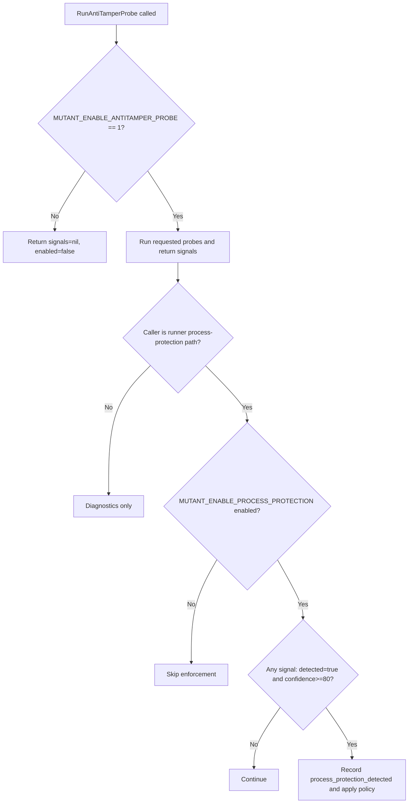

# Anti-Tamper Probe Enablement LLD

## 1. Purpose

This LLD defines how anti-tamper probe execution is enabled, how runner
enforcement is gated, and how diagnostics differ from enforcement.

## 2. Problem Statement

Users often confuse:

1. probe execution enablement
2. process-protection enforcement enablement
3. policy action after detection

This design separates these decisions clearly.

## 3. Inputs

### 3.1 Master Probe Gate

`MUTANT_ENABLE_ANTITAMPER_PROBE`

1. Value `1` means probes run.
2. Any other value means probes are skipped.

### 3.2 Process Protection Gate

`MUTANT_ENABLE_PROCESS_PROTECTION`

1. Evaluated by runner process-protection path.
2. Default enabled when unset.
3. Disabled by: `0`, `false`, `off`, `no`.

### 3.3 Policy Inputs

1. `MUTANT_TAMPER_RESPONSE`
2. `MUTANT_PROTECTION_PROFILE`
3. secure/compat/dev mode context

## 4. Decision Model

## 5. Caller Semantics

### 5.1 Runner

1. Uses focused 5-probe enforcement set.
2. Applies confidence threshold (`>= 80`).
3. Triggers policy action on threshold hit.

### 5.2 Builtins

1. Use broader probe sets for diagnostics.
2. Return probe signals to scripts/users.
3. Do not directly enforce runner blocking path.

## 6. Observability

Telemetry events:

1. `anti_tamper_probe_invoked`
2. `anti_tamper_probe_error`
3. `process_protection_detected`

## 7. Risks and Mitigations

Risk:

1. False negatives if probe gate is left disabled.

Mitigation:

1. Document production recommended env posture.
2. Add deployment checks for required security env vars.

Risk:

1. False positives when a single heuristic is noisy.

Mitigation:

1. Keep confidence thresholding and multi-probe context.
2. Review `detail` field before escalation.

## 8. Student Takeaway

There are three separate questions:

1. Did probes run?
2. Was enforcement enabled?
3. What did policy decide?

Keeping these separate prevents most operational confusion.
