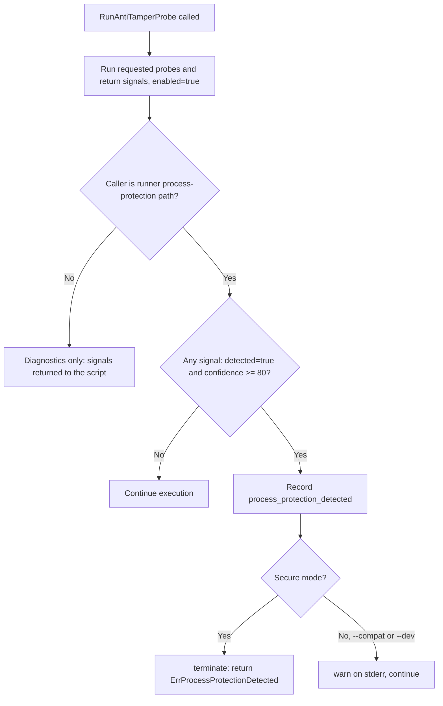

# Anti-Tamper Probe Enablement LLD

## 1. Purpose

This LLD defines how anti-tamper probe execution is enabled, how runner
enforcement is gated, and how diagnostics differ from enforcement.

## 2. Problem Statement

Users often confuse:

1. probe execution enablement
2. process-protection enforcement enablement
3. policy action after detection

This design separates these decisions clearly.

## 3. Gates

There are no configurable inputs. Every gate below is a compile-time constant or
is derived from the execution mode on the command line; none is settable, and
none was ever read from a file. The four environment variables this section used
to document -- a master probe gate, a process-protection gate, a tamper-response
override and a protection-profile selector -- were removed along with every
other environment read. Mutant takes no configuration from the environment; see
[CONFIGURATION_POLICY.md](CONFIGURATION_POLICY.md).

### 3.1 Master probe gate — always on

`antiTamperProbeEnabled` in `security/antitamper_probe.go` is a package-level
`true`. `isAntiTamperProbeEnabled()` returns it, and `RunAntiTamperProbe`
short-circuits to `(nil, false, nil)` when it is false.

The only thing that flips it is `SetAntiTamperProbeEnabledForTesting`, which
exists so a test can assert the disabled path. In a shipped binary it is never
called, so probes always run.

### 3.2 Process-protection gate — always on

`isProcessProtectionEnabled()` in `runner/runner.go` returns `true`. The runner
reaches it through the `processProtectionOn` package variable, which tests
replace to exercise the skip path.

### 3.3 What actually varies: the response

Probing is unconditional; what a detection *does* is not. Two things decide that:

1. **The confidence threshold.** `processProtectionTerminateConfidence = 80` in
   `runner/runner.go`. A signal below it is ignored by the runner, whatever it
   detected.
2. **The execution mode**, from argv. `ResolveTamperResponse(secureMode)`
   returns `terminate` in secure mode (the default) and `warn` under `--compat`
   or `--dev`. The protection profile feeds into this, but
   `ResolveProtectionProfile()` returns the constant `standard`, so the
   `minimal` and `paranoid` branches are unreachable at runtime; they survive
   only so `ProtectionProfileFromCode` can read back a V3 release trailer.

## 4. Decision Model

```mermaid
flowchart TD
    A[RunAntiTamperProbe called] --> B[Run requested probes and return signals, enabled=true]

    B --> C{Caller is runner process-protection path?}
    C -->|No| D[Diagnostics only: signals returned to the script]
    C -->|Yes| E{Any signal: detected=true and confidence >= 80?}
    E -->|No| F[Continue execution]
    E -->|Yes| G[Record process_protection_detected]
    G --> H{Secure mode?}
    H -->|Yes| I[terminate: return ErrProcessProtectionDetected]
    H -->|No, --compat or --dev| J[warn on stderr, continue]
```

The gate diamonds the previous version of this diagram carried are gone because
the gates they tested are gone: both are constants, so the only branch left in
the enablement path is the caller's own, and the only genuine decision points
are the confidence threshold and the execution mode.

## 5. Caller Semantics

### 5.1 Runner

1. Uses focused 5-probe enforcement set.
2. Applies confidence threshold (`>= 80`).
3. Triggers policy action on threshold hit.

### 5.2 Builtins

1. Use broader probe sets for diagnostics.
2. Return probe signals to scripts/users.
3. Do not directly enforce runner blocking path.

## 6. Observability

Telemetry events:

1. `anti_tamper_probe_invoked`
2. `anti_tamper_probe_error`
3. `process_protection_detected`

## 7. Risks and Mitigations

Risk:

1. False negatives because probing was switched off in a deployment.

Mitigation:

1. Structurally removed. There is no switch: both gates are constants, and the
   only setter is test-only. A deployment cannot be misconfigured into running
   with probes off, and there is nothing to check for at deploy time.

Risk:

1. False positives when a single heuristic is noisy.

Mitigation:

1. Keep confidence thresholding and multi-probe context.
2. Review `detail` field before escalation.
3. `--compat` downgrades the response to a warning, so a noisy environment can
   still run the program while the signal stays visible on stderr.

## 8. Student Takeaway

There are three separate questions:

1. Did probes run? **Always yes.**
2. Was enforcement enabled? **Always yes, on the runner path.**
3. What did policy decide? **The only real variable** -- the confidence
   threshold and the execution mode from argv.

Keeping these separate prevents most operational confusion. The first two used
to be configurable and were the usual source of it.
