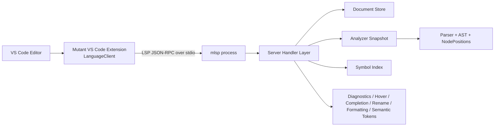
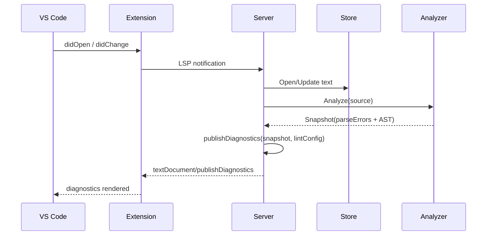
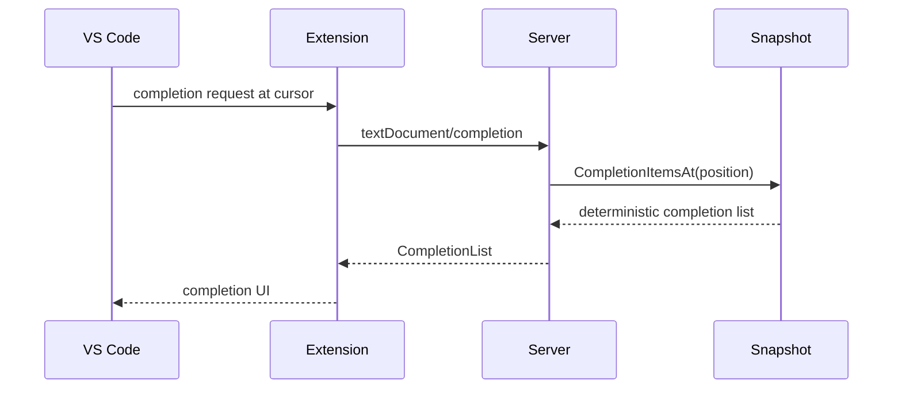
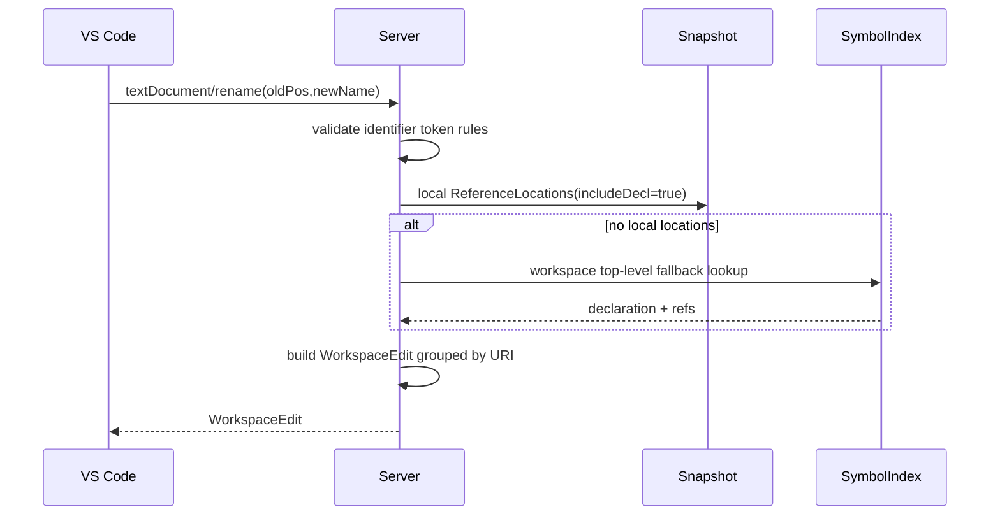

# Mutant LSP + VS Code Extension Low-Level Design (LLD)

This is the implementation-level developer guide for the Mutant language tooling
stack.

Audience:

- Junior or new engineers who need to understand how Mutant language tooling
  works end-to-end.
- Maintainers adding or changing LSP features, diagnostics, formatting,
  completion, hover/signature behavior, or extension lifecycle behavior.

Scope:

- Go LSP server in [lsp/cmd/mlsp/main.go](../lsp/cmd/mlsp/main.go) and
  [lsp/internal/server/server.go](../lsp/internal/server/server.go)
- Analyzer pipeline in [lsp/internal/analyzer](../lsp/internal/analyzer)
- Workspace state/index in [lsp/internal/workspace](../lsp/internal/workspace)
- VS Code extension host/client in
  [vscode-extension/src/extension.ts](../vscode-extension/src/extension.ts)

## 1. Architecture Overview

Core separation of concerns:

- Extension is process lifecycle + UX shell around the language server.
- LSP server is request handling, state, and protocol behavior.
- Analyzer is language intelligence over current AST snapshot.
- Workspace index enables cross-file symbol/reference behavior.

## 2. Runtime Components

### 2.1 LSP binary entrypoint

- Entrypoint: [lsp/cmd/mlsp/main.go](../lsp/cmd/mlsp/main.go)
- Behavior:

1. Parse `-debug` flag
2. Build server via `server.New(debug)`
3. Run over stdio via `server.Run()`

### 2.2 JSON-RPC transport bridge

- Adapter:
  [lsp/internal/server/transport.go](../lsp/internal/server/transport.go)
- Why it exists:
- `glsp` handler methods are wired into a `jsonrpc2` stdio connection.
- It translates method/params and maps validation failures to JSON-RPC error
  codes.

Transport flow:

1. Read request from stdin stream.
2. Build `glsp.Context` with method, params, Notify, and Call handlers.
3. Dispatch with `handler.Handle(...)`.
4. Reply (unless notification).

### 2.3 Server state and handler wiring

- Main implementation:
  [lsp/internal/server/server.go](../lsp/internal/server/server.go)

Server owns:

- LSP method handler table
- Document store (`documents`)
- Symbol index (`symbols`)
- Analyzer instance (`analyzer`)
- Per-document snapshots map (`snapshots`)
- Lint configuration
- Crash/fallback flags (for semantic token panic fallback warning)

Important constructor behavior:

- `New(debug bool)` binds all supported LSP endpoints to receiver methods.
- `initialize` advertises capabilities like completion, hover, signature help,
  references, rename, formatting, semantic tokens.

### 2.4 Document store

- Files: [lsp/internal/workspace/store.go](../lsp/internal/workspace/store.go),
  [lsp/internal/workspace/document.go](../lsp/internal/workspace/document.go)
- Responsibility:
- Track opened documents and versions.
- Apply incremental text changes from LSP content change events.
- Return immutable clone snapshots to avoid accidental shared mutation.

### 2.5 Analyzer snapshot model

- Files:
  [lsp/internal/analyzer/snapshot.go](../lsp/internal/analyzer/snapshot.go),
  [lsp/internal/analyzer/analyzer.go](../lsp/internal/analyzer/analyzer.go)
- Snapshot contains:
- raw source
- parsed AST program (`Program`)
- parse errors

Analyzer steps:

1. Lex + parse source into AST.
2. Preserve node ranges (`NodePositions`) from parser output.
3. Serve semantic queries (hover, completion, definitions, references, symbols,
   semantic tokens, signature help).

### 2.6 Workspace symbol index

- File:
  [lsp/internal/workspace/symbol_index.go](../lsp/internal/workspace/symbol_index.go)
- Purpose:
- Cache top-level symbols per document for workspace symbol search.
- Cache unresolved identifier usages to improve cross-document references.

This enables cross-file behaviors when a symbol is not resolvable only within a
single snapshot.

## 3. LSP Capability Map (Method -> Implementation)

| LSP method                       | Server method            | Core implementation dependencies                             |
| -------------------------------- | ------------------------ | ------------------------------------------------------------ |
| initialize                       | `initialize`             | Capabilities + semantic legend from analyzer                 |
| textDocument/didOpen             | `didOpen`                | store open -> analyze -> set snapshot -> publish diagnostics |
| textDocument/didChange           | `didChange`              | incremental apply -> analyze -> publish diagnostics          |
| textDocument/didClose            | `didClose`               | delete store/snapshot/index + clear diagnostics              |
| textDocument/hover               | `hover`                  | `Snapshot.HoverText`                                         |
| textDocument/completion          | `completion`             | `Snapshot.CompletionItemsAt`                                 |
| textDocument/signatureHelp       | `signatureHelp`          | `Snapshot.SignatureHelp`                                     |
| textDocument/documentSymbol      | `documentSymbols`        | `Snapshot.DocumentSymbols`                                   |
| textDocument/definition          | `definition`             | local definition + workspace fallback                        |
| textDocument/typeDefinition      | `typeDefinition`         | `Snapshot.TypeDefinitionLocation`                            |
| textDocument/references          | `references`             | local refs + workspace refs + dedupe                         |
| textDocument/prepareRename       | `prepareRename`          | local rename target + workspace fallback                     |
| textDocument/rename              | `rename`                 | location collection + per-URI sorted text edits              |
| textDocument/codeAction          | `codeActions`            | diagnostic-driven quick fixes                                |
| textDocument/semanticTokens/full | `semanticTokensFull`     | semantic token data + panic fallback                         |
| textDocument/formatting          | `formatting`             | AST formatter + safety-preserving fallback                   |
| textDocument/onTypeFormatting    | `onTypeFormatting`       | trigger-based canonicalization while typing (opt-in)         |
| workspace/symbol                 | `workspaceSymbols`       | SymbolIndex query                                            |
| workspace/didChangeConfiguration | `didChangeConfiguration` | lint config parse + diagnostics republish                    |

## 4. Key Request Flows

### 4.1 Open/change diagnostics flow

### 4.2 Completion flow

Implementation notes:

- Completions include keywords, builtins, snippets, visible scope bindings.
- Ordering is deterministic and stabilized with explicit sort keys in analyzer.

### 4.3 Rename flow

## 5. Diagnostics and Linting

Core file:
[lsp/internal/analyzer/diagnostics.go](../lsp/internal/analyzer/diagnostics.go)

Diagnostics sources:

- `mutant-parser`: parser errors from snapshot parse errors.
- `mutant-lint`: semantic lint rules.

Current lint rules:

- duplicate top-level declaration
- unused declaration (top-level and local)
- undefined identifier
- nesting complexity in function bodies (depth > 2)

Config ingestion path:

1. Extension sends settings changes via `workspace/didChangeConfiguration`.
2. Server parses with
   [lsp/internal/server/lint_config.go](../lsp/internal/server/lint_config.go).
3. `republishAllDiagnostics` updates existing open documents.

Supported severities:

- error, warning, information, hint, off

## 6. Formatting Design

Core file:
[lsp/internal/server/formatter.go](../lsp/internal/server/formatter.go)

Behavior model:

- If parse errors exist (or snapshot invalid), formatter uses whitespace
  normalization only.
- If source contains comments or intentional blank lines, formatter preserves
  structure by using normalization path.
- Otherwise it applies AST-driven formatting for statements/expressions.

Canonical style policy:

- Opening braces stay on the same line for supported constructs (`if (...) {`,
  `for (...) {`, `fn(...) {`, `else {`).
- Source-layout mode still preserves authored comments/blank lines, but style-2
  standalone opening braces are canonicalized to style-1.

On-type formatting behavior:

- Server advertises `textDocument/onTypeFormatting` and supports triggers for
  `}`, `;`, and newline.
- Extension keeps on-type formatting disabled by default to avoid intrusive
  edits, and exposes an opt-in setting.

Important safety guarantees:

- String literal quotes are preserved and escaped.
- Formatting returns nil edits for noop output.

## 7. Semantic Tokens and Resilience

Semantic token production is in analyzer logic and requested through
`textDocument/semanticTokens/full`.

Resilience behavior in
[lsp/internal/server/server.go](../lsp/internal/server/server.go):

- method-level panic recovery in semantic token handler
- one-time user warning if fallback path is used
- returns empty token list on failure instead of crashing LSP process

This prevents editor crash loops from semantic token panics.

## 8. Hover, Signature Help, and Teaching Metadata

Teaching metadata source:

- [lsp/internal/analyzer/language_teach.go](../lsp/internal/analyzer/language_teach.go)

What it provides:

- keyword hover docs
- builtin hover/signature docs
- snippet completion templates

Builtin coverage model:

- Rich docs from `builtinDocs` map when defined.
- Prefix-based fallback for builtin families (`fs_`, `db_`, `bytes_`, `http_`,
  etc.).
- Generic fallback for any builtin registered in
  [builtin/builtin.go](../builtin/builtin.go).

Result:

- Newly added builtins are auto-discoverable in completion and still have
  baseline hover/signature coverage.

## 9. VS Code Extension Design

Main file:
[vscode-extension/src/extension.ts](../vscode-extension/src/extension.ts)

Responsibilities:

- Activate language client and commands.
- Resolve language server command path.
- Manage restarts and crash-loop backoff.
- Offer operational commands (status, logs, restart, smoke checks).

### 9.1 Binary selection algorithm

If `mutant.languageServer.path` is configured and non-empty:

- use it exactly.

Else:

1. Gather workspace roots and parent directories.
2. Search for `mlsp*` binaries with accepted naming variants.
3. Pick latest by modification time.
4. Fallback to `mlsp.exe` on Windows or `mlsp` elsewhere.

Code path:

- `resolveLanguageServerCommandFromInputs`
- `findLatestServerBinary`
- `isLanguageServerBinaryName`

### 9.2 Crash-loop mitigation

The extension tracks crash timestamps in a rolling window:

- window: 3 minutes
- block threshold: 5 crashes in window

When threshold is reached:

- automatic restart is disabled
- user is prompted to run manual restart command

Code path:

- `recordCrashAndGetStatus`
- language client `errorHandler.closed`

### 9.3 Commands exposed

Declared in [vscode-extension/package.json](../vscode-extension/package.json),
implemented in
[vscode-extension/src/extension.ts](../vscode-extension/src/extension.ts):

- Mutant: Open Smoke File
- Mutant: Run LSP Smoke Checks
- Mutant: Show LSP Status
- Mutant: Show LSP Logs
- Mutant: Restart LSP
- Mutant: Copy LSP Logs

## 10. Deterministic Behavior Rules

Determinism safeguards already in codebase:

- Completion ordering is canonicalized and stable (category + label + kind +
  explicit `SortText`).
- Node selection tie-breaks use deterministic specificity logic.
- Workspace symbol ordering is sorted by name/location.
- Rename edits are sorted by range per file before response.

These rules reduce editor flicker and test flakiness.

## 11. Testing Strategy

### 11.1 Server tests

- File:
  [lsp/internal/server/server_test.go](../lsp/internal/server/server_test.go)
- Covers initialization capabilities, diagnostics, completion, hover,
  references, formatting, semantic tokens, rename, configuration behavior, and
  regressions.

### 11.2 Analyzer tests

- File:
  [lsp/internal/analyzer/analyzer_test.go](../lsp/internal/analyzer/analyzer_test.go)
- Includes semantic robustness and builtin teaching coverage regression checks.

### 11.3 Extension integration tests

- File:
  [vscode-extension/src/test/suite/extension.test.ts](../vscode-extension/src/test/suite/extension.test.ts)
- Covers activation, command registration, crash backoff, binary selection, and
  config override behavior.

## 12. Change Playbooks

### 12.1 Add a new LSP feature

1. Add capability advertisement in `initialize` if needed.
2. Add server handler in constructor wiring.
3. Implement method in server layer.
4. Add analyzer APIs if semantic analysis is needed.
5. Add tests in server/analyzer test suites.
6. Add extension-side UX command only if user-facing operation is needed.

### 12.2 Add a new builtin function

1. Register builtin in [builtin/builtin.go](../builtin/builtin.go).
2. Optional but recommended: add rich doc entry in `builtinDocs` at
   [lsp/internal/analyzer/language_teach.go](../lsp/internal/analyzer/language_teach.go).
3. Run analyzer/server tests. Existing regression tests verify baseline
   completion/hover/signature coverage for all builtins.

### 12.3 Add a new lint rule

1. Implement lint function in
   [lsp/internal/analyzer/diagnostics.go](../lsp/internal/analyzer/diagnostics.go).
2. Add config field to `LintConfig` and severity parser in
   [lsp/internal/server/lint_config.go](../lsp/internal/server/lint_config.go).
3. Expose setting in
   [vscode-extension/package.json](../vscode-extension/package.json).
4. Add tests for default severity, override, and off behavior.

### 12.4 Add or change extension setting

1. Add schema entry under `contributes.configuration.properties` in
   [vscode-extension/package.json](../vscode-extension/package.json).
2. Read/consume in
   [vscode-extension/src/extension.ts](../vscode-extension/src/extension.ts).
3. Add integration test in
   [vscode-extension/src/test/suite/extension.test.ts](../vscode-extension/src/test/suite/extension.test.ts).
4. Document in [vscode-extension/README.md](../vscode-extension/README.md) and
   troubleshooting docs.

## 13. Build, Run, and Debug

LSP/server tests:

- `go test ./lsp/internal/server -v`
- `go test ./lsp/internal/analyzer -v`
- `go test ./...`

Extension:

- `cd vscode-extension`
- `npm install`
- `npm run compile`
- `npm test`
- Launch Extension Development Host with VS Code `F5`

Operational debugging:

- Use `Mutant: Show LSP Status`
- Use `Mutant: Show LSP Logs`
- Use `Mutant: Copy LSP Logs`
- Use `Mutant: Restart LSP` for manual recovery

## 14. Known Design Trade-offs

- Current formatter chooses preservation for comments/blank-line input rather
  than forcing full AST rewrite, to avoid destructive edits.
- Workspace reference fallback focuses on top-level symbols for predictable and
  performant cross-document behavior.
- Semantic token failures degrade gracefully to empty token data instead of
  hard-failing language services.

## 15. Related Docs

- [docs/VSCODE_LSP_TEACHING_REFERENCE.md](VSCODE_LSP_TEACHING_REFERENCE.md)
- [docs/VSCODE_EXTENSION_TROUBLESHOOTING.md](VSCODE_EXTENSION_TROUBLESHOOTING.md)
- [docs/VSCODE_EXTENSION_RELEASE_CHECKLIST.md](VSCODE_EXTENSION_RELEASE_CHECKLIST.md)
- [docs/LSP_EXTENSION_CHECKLIST.md](LSP_EXTENSION_CHECKLIST.md)
- [docs/LSP_EXTENSION_ONBOARDING_60_MIN.md](LSP_EXTENSION_ONBOARDING_60_MIN.md)
