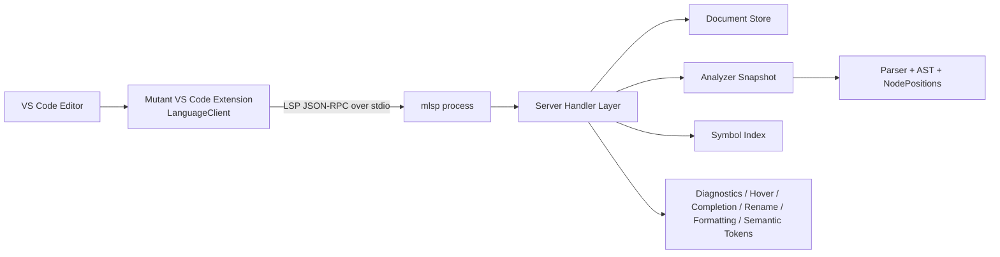
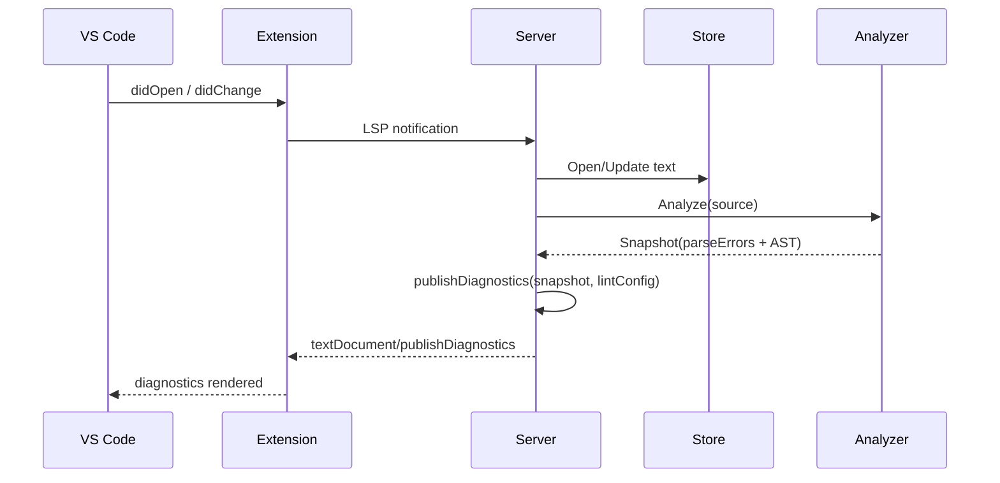
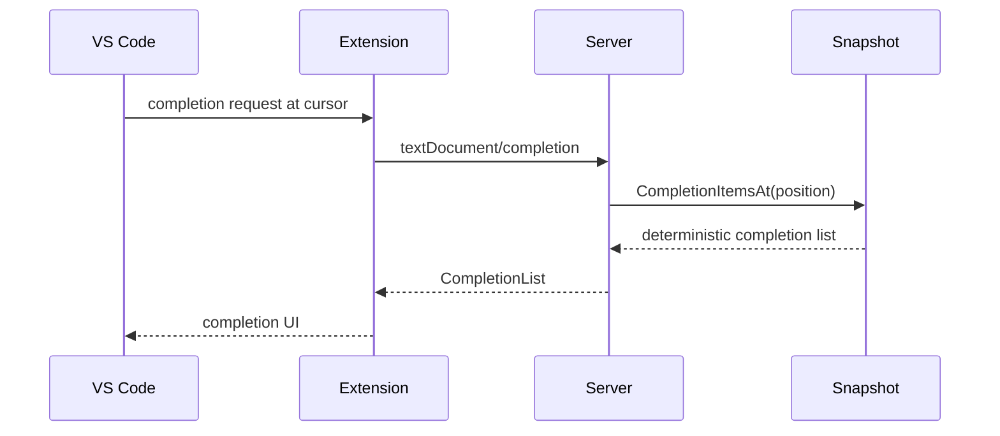
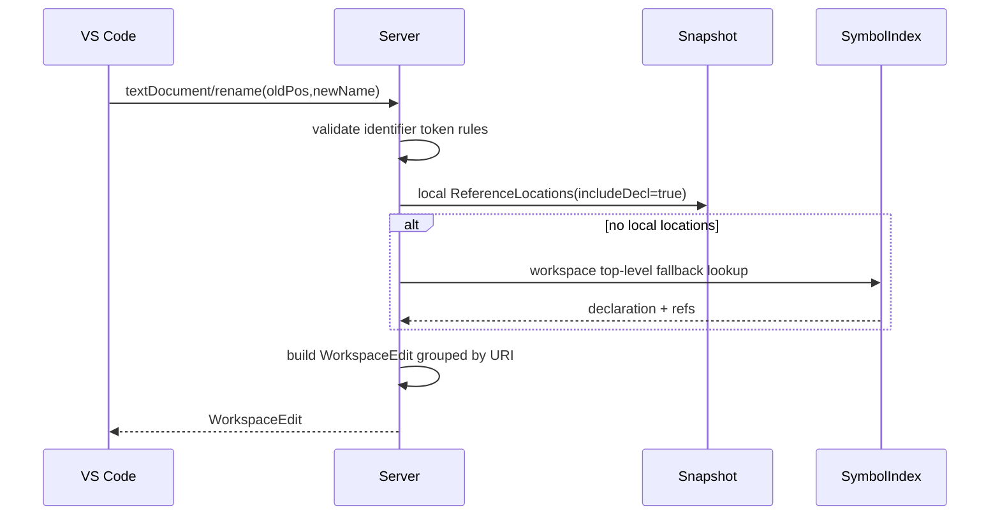

# Mutant LSP + VS Code Extension Low-Level Design (LLD)

This is the implementation-level developer guide for the Mutant language tooling
stack.

Audience:

- Junior or new engineers who need to understand how Mutant language tooling
  works end-to-end.
- Maintainers adding or changing LSP features, diagnostics, formatting,
  completion, hover/signature behavior, or extension lifecycle behavior.

Scope:

- Go LSP server in [lsp/cmd/mlsp/main.go](../lsp/cmd/mlsp/main.go) and
  [lsp/internal/server/server.go](../lsp/internal/server/server.go)
- Analyzer pipeline in [lsp/internal/analyzer](../lsp/internal/analyzer)
- Workspace state/index in [lsp/internal/workspace](../lsp/internal/workspace)
- VS Code extension host/client in
  [mutant-vscode-extension/src/extension.ts](../mutant-vscode-extension/src/extension.ts)

## 1. Architecture Overview

```mermaid
flowchart LR
  A[VS Code Editor] --> B[Mutant VS Code Extension\nLanguageClient]
  B -->|LSP JSON-RPC over stdio| C[mlsp process]
  C --> D[Server Handler Layer]
  D --> E[Document Store]
  D --> F[Analyzer Snapshot]
  D --> G[Symbol Index]
  F --> H[Parser + AST + NodePositions]
  D --> I[Diagnostics / Hover / Completion / Rename / Formatting / Semantic Tokens]
```

Core separation of concerns:

- Extension is process lifecycle + UX shell around the language server.
- LSP server is request handling, state, and protocol behavior.
- Analyzer is language intelligence over current AST snapshot.
- Workspace index enables cross-file symbol/reference behavior.

## 2. Runtime Components

### 2.1 LSP binary entrypoint

- Entrypoint: [lsp/cmd/mlsp/main.go](../lsp/cmd/mlsp/main.go)
- Behavior:

1. Parse `-debug` flag
2. Build server via `server.New(debug)`
3. Run over stdio via `server.Run()`

### 2.2 JSON-RPC transport bridge

- Adapter:
  [lsp/internal/server/transport.go](../lsp/internal/server/transport.go)
- Why it exists:
- `glsp` handler methods are wired into a `jsonrpc2` stdio connection.
- It translates method/params and maps validation failures to JSON-RPC error
  codes.

Transport flow:

1. Read request from stdin stream.
2. Build `glsp.Context` with method, params, Notify, and Call handlers.
3. Dispatch with `handler.Handle(...)`.
4. Reply (unless notification).

### 2.3 Server state and handler wiring

- Main implementation:
  [lsp/internal/server/server.go](../lsp/internal/server/server.go)

Server owns:

- LSP method handler table
- Document store (`documents`)
- Symbol index (`symbols`)
- Analyzer instance (`analyzer`)
- Per-document snapshots map (`snapshots`)
- Lint configuration
- Crash/fallback flags (for semantic token panic fallback warning)

Important constructor behavior:

- `New(debug bool)` binds all supported LSP endpoints to receiver methods.
- `initialize` advertises capabilities like completion, hover, signature help,
  references, rename, formatting, semantic tokens.

### 2.4 Document store

- Files: [lsp/internal/workspace/store.go](../lsp/internal/workspace/store.go),
  [lsp/internal/workspace/document.go](../lsp/internal/workspace/document.go)
- Responsibility:
- Track opened documents and versions.
- Apply incremental text changes from LSP content change events.
- Return immutable clone snapshots to avoid accidental shared mutation.

### 2.5 Analyzer snapshot model

- Files:
  [lsp/internal/analyzer/snapshot.go](../lsp/internal/analyzer/snapshot.go),
  [lsp/internal/analyzer/analyzer.go](../lsp/internal/analyzer/analyzer.go)
- Snapshot contains:
- raw source
- parsed AST program (`Program`)
- parse errors (hard failures)
- recoverables (`Recoverables`): non-fatal parser findings — most importantly the
  missing/redundant semicolon channel — surfaced via `SemicolonProblems()`. The
  tree still parses into a usable AST; these drive the `semicolon` diagnostic and
  its quick fixes.

Analyzer steps:

1. Lex + parse source into AST.
2. Preserve node ranges (`NodePositions`) from parser output.
3. Serve semantic queries (hover, completion, definitions, references, symbols,
   semantic tokens, signature help).

### 2.6 Workspace symbol index

- File:
  [lsp/internal/workspace/symbol_index.go](../lsp/internal/workspace/symbol_index.go)
- Purpose:
- Cache top-level symbols per document for workspace symbol search.
- Cache unresolved identifier usages to improve cross-document references.

This enables cross-file behaviors when a symbol is not resolvable only within a
single snapshot.

## 3. LSP Capability Map (Method -> Implementation)

| LSP method                       | Server method            | Core implementation dependencies                             |
| -------------------------------- | ------------------------ | ------------------------------------------------------------ |
| initialize                       | `initialize`             | Capabilities + semantic legend from analyzer                 |
| textDocument/didOpen             | `didOpen`                | store open -> analyze -> set snapshot -> publish diagnostics |
| textDocument/didChange           | `didChange`              | incremental apply -> analyze -> publish diagnostics          |
| textDocument/didClose            | `didClose`               | delete store/snapshot/index + clear diagnostics              |
| textDocument/hover               | `hover`                  | `Snapshot.HoverText`                                         |
| textDocument/completion          | `completion`             | `Snapshot.CompletionItemsAt`                                 |
| textDocument/signatureHelp       | `signatureHelp`          | `Snapshot.SignatureHelp`                                     |
| textDocument/documentSymbol      | `documentSymbols`        | `Snapshot.DocumentSymbols`                                   |
| textDocument/definition          | `definition`             | local definition + workspace fallback                        |
| textDocument/typeDefinition      | `typeDefinition`         | `Snapshot.TypeDefinitionLocation`                            |
| textDocument/references          | `references`             | local refs + workspace refs + dedupe                         |
| textDocument/prepareCallHierarchy | `prepareCallHierarchy`  | declaration under the cursor, following a module member      |
| callHierarchy/incomingCalls      | `callHierarchyIncomingCalls` | graph call edges + `alias.name(` sites in importing files |
| callHierarchy/outgoingCalls      | `callHierarchyOutgoingCalls` | graph call edges out of the declaration                   |
| textDocument/prepareRename       | `prepareRename`          | local rename target + workspace fallback                     |
| textDocument/rename              | `rename`                 | location collection + per-URI sorted text edits              |
| textDocument/codeAction          | `codeActions`            | diagnostic-driven quick fixes                                |
| textDocument/semanticTokens/full | `semanticTokensFull`     | semantic token data + panic fallback                         |
| textDocument/formatting          | `formatting`             | AST formatter + safety-preserving fallback                   |
| textDocument/onTypeFormatting    | `onTypeFormatting`       | trigger-based canonicalization while typing (opt-in)         |
| workspace/symbol                 | `workspaceSymbols`       | SymbolIndex query                                            |
| workspace/didChangeConfiguration | `didChangeConfiguration` | lint config parse + diagnostics republish                    |

## 4. Key Request Flows

### 4.1 Open/change diagnostics flow

```mermaid
sequenceDiagram
  participant VS as VS Code
  participant EXT as Extension
  participant LSP as Server
  participant ST as Store
  participant AZ as Analyzer

  VS->>EXT: didOpen / didChange
  EXT->>LSP: LSP notification
  LSP->>ST: Open/Update text
  LSP->>AZ: Analyze(source)
  AZ-->>LSP: Snapshot(parseErrors + AST)
  LSP->>LSP: publishDiagnostics(snapshot, lintConfig)
  LSP-->>EXT: textDocument/publishDiagnostics
  EXT-->>VS: diagnostics rendered
```

### 4.2 Completion flow

```mermaid
sequenceDiagram
  participant VS as VS Code
  participant EXT as Extension
  participant LSP as Server
  participant AZ as Snapshot

  VS->>EXT: completion request at cursor
  EXT->>LSP: textDocument/completion
  LSP->>AZ: CompletionItemsAt(position)
  AZ-->>LSP: deterministic completion list
  LSP-->>EXT: CompletionList
  EXT-->>VS: completion UI
```

Implementation notes:

- Completions include keywords, builtins, snippets, visible scope bindings.
- Ordering is deterministic and stabilized with explicit sort keys in analyzer.

### 4.3 Rename flow

```mermaid
sequenceDiagram
  participant VS as VS Code
  participant LSP as Server
  participant AZ as Snapshot
  participant IDX as SymbolIndex

  VS->>LSP: textDocument/rename(oldPos,newName)
  LSP->>LSP: validate identifier token rules
  LSP->>AZ: local ReferenceLocations(includeDecl=true)
  alt no local locations
    LSP->>IDX: workspace top-level fallback lookup
    IDX-->>LSP: declaration + refs
  end
  LSP->>LSP: build WorkspaceEdit grouped by URI
  LSP-->>VS: WorkspaceEdit
```

## 5. Diagnostics and Linting

Core file:
[lsp/internal/analyzer/diagnostics.go](../lsp/internal/analyzer/diagnostics.go)

Diagnostics sources:

- `mutant-parser`: parser errors from snapshot parse errors, plus the
  string/comment-aware delimiter-balance checker.
- `mutant-lint`: semantic lint rules.
- `mutant-format`: strict-formatting rules (the semicolon rule) — distinct from
  `mutant-lint` so quick fixes can key off it.

Current lint rules (rule id -> default severity):

- `duplicateTopLevelDeclaration` -> warning (also nested duplicates)
- `unusedDeclaration` -> warning (top-level and local; skips `_`. A module-shaped
  file -- one with no top-level action -- exempts its top-level names, because
  they exist for whatever imports it; a top-level `_private` name is NOT
  exempt, because no other file can reach it)
- `unusedImport` -> information (an import that brings nothing this file uses:
  its namespace is never read AND it declares no struct, enum or macro the file
  names bare -- those three cross a module boundary without a namespace, so the
  alias not appearing is not the whole question. Information rather than warning
  because the imported module's top-level statements run either way and Mutant
  has no `import _` form)
- `undefinedDeclaration` -> error (scope-aware; builtins + macro special forms
  count as defined)
- `nestingComplexity` -> warning (if/for nesting depth > 2 in function bodies)
- `semicolon` -> warning (missing/redundant `;`, source `mutant-format`; both have
  quick fixes and the formatter also repairs them on save)
- `unreachableCode` -> warning (statements after an unconditional
  `return`/`break`/`continue` in a statement list; literal control flow only)
- `platformSupport` -> warning (**OS-aware**: warns when a program calls a builtin
  that is not supported on the operating system the language server is running on,
  e.g. a Windows/Linux-only builtin such as `process_modules` used on macOS). The
  supported-platform set comes from `builtin.PlatformSupport` /
  `builtin.UnsupportedOn` in [builtin/metadata.go](../builtin/metadata.go); the
  host OS is `runtime.GOOS` (overridable in tests via the analyzer's `hostGOOS`).
- `builtinArity` -> warning (a fixed-arity builtin called with the wrong number
  of arguments; the contract comes from `builtin.TypedSignature`)
- `builtinArgType` -> warning (a builtin passed a kind its parameter cannot
  accept, for arguments whose type is certain -- a literal, or a name that is
  never reassigned)
- `builtinSingleReturn` -> warning (several names bound from a builtin that
  returns one value rather than a `(value, err)` pair; from
  `builtin.ReturnSpec(name).Pair`)
- `builtinPairReturn` -> warning (one name bound from a builtin that *does*
  return a `(value, err)` pair, so the name holds the whole MULTI_VALUE. The
  mirror of `builtinSingleReturn`, off the same contract. It is the only lint
  rule that cannot decide at the call site: holding a pair on purpose is legal,
  so the walk collects candidates and drops any name the program later indexes,
  returns, or destructures)
- `builtinDeprecated` -> hint (a call to a builtin kept only so existing
  programs keep working; the message names its replacement, from
  `builtin.DeprecatedBy`). A hint rather than a warning because the call is
  correct and still runs. It carries `DiagnosticTagDeprecated`, which is what
  makes editors strike the name through. Independent of the arity and type
  rules: a wrong-arity call to a deprecated builtin is still a call to a
  deprecated builtin, so both are reported.
- `spawnGlobalWrite` -> warning (a `spawn`/`pmap`/`peach` callback assigning to
  a top-level name. Those callbacks run on a worker VM with a *snapshot* of the
  globals, so the write lands in a copy that is discarded when the callback
  finishes. Only a function literal written at the call site is examined, and
  only a name the callback does not rebind for itself -- a callback passed by
  name may also be called normally elsewhere, where the write does take effect)
- `unclosedResource` -> warning (a builtin that opens a handle -- `ntfs_open`,
  `zip_open`, `chan_new`, `net_connect` and their families -- bound to a name
  nothing in the same scope closes. Handles live in a package-level store with
  no cap, no eviction and no cleanup at exit, so an unclosed one is held for the
  life of the process: theoretical in a script that exits, descriptor exhaustion
  in a loop over a corpus or a long-running server. Curated opener/closer table
  in [unclosed_resource.go](../lsp/internal/analyzer/unclosed_resource.go),
  pinned to the registry by test so a new `*_close` family cannot be added
  without being accounted for -- a closer that closes nothing a name can hold
  (`case_close` ends a process-wide session and takes no arguments) goes in
  `nonResourceClosers` with its reason rather than being silently skipped. The rule declines whenever the handle is used
  somewhere it cannot follow -- returned, passed to a helper, stored, printed --
  when the closer is named anywhere in the scope including inside the string
  `with_resource` takes, and when the resource is held by something with no
  reachable end: a `for` with no exit condition, or a listener handed to
  `net_serve`)
- `uncheckedError` -> warning (`let value, err = f(...)` against a builtin whose
  `builtin.ReturnSpec` declares the `(value, err)` contract, where nothing reads
  that binding of `err` before the name is rebound or the scope ends. A failed
  call leaves null in the value, so the program carries on with nothing and
  reports success. It reads the same contract as `builtinSingleReturn` and
  `builtinPairReturn` from the opposite direction: those two ask whether the
  binding's shape matches the builtin's, this one takes a binding whose shape is
  already right and asks whether the error half was used.

  It answers **per binding, not per name**, and that is the whole reason it
  exists alongside `unusedDeclaration`. Measured over `examples/**` before it
  was written, `unusedDeclaration` reported an unread `err` three times in 104
  files: `err` is bound 85 times over at the top level, so it is a duplicate
  name and gets skipped wholesale, and its reference lookup answers for the name
  rather than the binding. Asking the narrower question finds 40.

  Quiet when the error is read in any way at all -- tested, printed, returned,
  passed on, stored -- when a nested function mentions the name (a closure runs
  when it is called, not where it is written), when `_` is bound, and when the
  failure is caught through the value instead: the value written into an `if` or
  `for` condition, or a BOOLEAN success value read anywhere, since that one is
  false on every failure path)
- `matchExhaustiveness` -> warning (a `match` whose every arm is a variant of
  one enum declared in the same file, with no `_` arm and at least one variant
  unmatched. A match must produce a value, so a subject no arm matches raises
  rather than yielding null -- which means adding a variant leaves every
  existing match over it one arm short, silently. Quiet on a literal pattern,
  two different enums, an imported enum whose variants live in another file, a
  `_` arm, or a name that is both an enum and a `let` binding)

### The security rules (T-2)

Seven rules that read *intent* rather than a declared contract. The four
contract rules above are right by construction -- each compares a call site
against a fact `builtin.ReturnSpec` or `TypedSignature` states. These cannot be,
so each carries its own answer to "what makes this certain enough to squiggle?",
and they share one principle: **what the program does with a value decides the
finding, not what the value looks like.** Shape heuristics alone are what makes
a security linter something people switch off, and a switched-off rule catches
nothing.

Shared plumbing -- scope walking, one-hop `let` resolution, literal reading --
is in [security_lint.go](../lsp/internal/analyzer/security_lint.go). Names are
followed exactly one hop, and only when bound once in the scope, because the
corpus writes `let tls_opts = {...}; net_tls_connect(h, t, tls_opts)` and a rule
that only read an inline literal would miss the idiom the examples teach. §1
applies throughout: these rules warn, and none reads or validates a capability
policy.

- `tlsVerificationDisabled` -> warning (`insecure: true` on `net_tls_connect` or
  `net_tls_upgrade_client`, or a `min_version` of `"1.0"` / `"1.1"` on any of
  the four TLS builtins, in a literal option hash or struct. Exact rather than
  heuristic: it reads the keys `applyClientTLSOptions` /
  `applyServerTLSOptions` read. `insecure` is reported only on the client side,
  because the server never reads it. It never reports a *missing*
  `min_version` -- a default is the runtime's business, and demanding the
  option be written out would be style advice wearing a security rule's
  clothes)
- `unboundedResource` -> warning (`cidr_hosts` with more than 20 host bits, or
  `range` longer than 10,000,000, from literal arguments. Neither builtin is
  actually unbounded -- both raise -- so the finding is "this call fails at run
  time", which puts the rule in `builtinArity`'s certainty class: it evaluates
  exactly the predicate the builtin evaluates. There is no threshold here that
  anybody chose; both numbers are read off the implementations and pinned by
  test. `cidr_hosts("10.0.0.0/8")` is the call it exists for -- it reads as a
  reasonable network sweep and it fails)
- `weakCrypto` -> warning (a digest from `hash_md5`, `hash_sha1` or
  `hash_crc32` compared for equality against a digest written into the program,
  or an `hmac` over a literal `"md5"` / `"sha1"`. The rule does not look at the
  algorithm, because in a forensic language MD5 *is* the job: matching an
  artifact against a known-file set wants MD5 specifically, since the other side
  of the comparison is MD5. It looks at the decision instead -- verifying
  against an expected value is authenticity, and both algorithms have had
  practical collisions for years. Comparing two computed digests, storing one,
  printing one or passing one to `hashset_contains` is matching, and stays
  quiet. `imphash`, `nt_hash` and `lm_hash` are never reported: they are MD5,
  MD4 and DES by the definition of the artifact)
- `hardcodedSecret` -> warning (a credential-shaped literal under a
  credential-shaped name -- `let`, hash key or struct field -- or matching a
  provider's published prefix: AWS, GitHub, Slack, a PEM private-key header, a
  signed JWT. Three questions have to agree: is it called a secret or shaped
  like one, does the value read as issued rather than as a word or a
  placeholder, and does the program *use* it as a credential rather than take
  it apart. That third one is the interesting one. A forensic language holds
  credential-shaped strings for the same reason it holds malware -- they are
  the subject -- so a value whose fate is `jwt_decode`, `base64_decode`,
  `pem_decode` or `x509_parse` is a sample under examination and is never
  reported. That keeps both sample JWTs in `examples/` quiet without a
  suppression comment, because it is a statement about the program rather than
  about the linter. A literal in a bare argument position carries no name
  signal, which is what leaves `hmac("secret-key", ...)` alone)
- `commandInjection` -> warning (a value interpolated or concatenated into the
  string `exec_string` hands a shell, the line `cmd_add` adds to a builder, or
  the script `lua_run_string` runs. `exec_string` does not run a program with
  arguments -- it hands a whole string to a shell, which decides where one word
  ends and the next begins, so a spliced value is syntax and not an argument.
  The report sits on `cmd_add` rather than `cmd_run` because that is where the
  string is assembled. A command built only from literals is a constant written
  in pieces and stays quiet, and so does a value that first goes through
  `url_encode`, `base64_encode`, `hex_encode`, `to_int`, `parse_int`,
  `text_replace` or `regex_replace` -- the rule has to have a way to comply.
  It says nothing about `exec_string(command)` where the whole string arrives
  as one value: that is a question about where the value came from, which is
  `pathTraversal`'s machinery)
- `evidenceMutation` -> warning (`fs_write`, `fs_append`, `fs_delete`,
  `fs_move`, or the *destination* of `fs_copy`, aimed at a path the same program
  opened as evidence -- `raw_open`, `ewf_open`, `vhdi_open`, a filesystem or
  hive opener, an archive. The rule only this language can write: elsewhere a
  path is a path, but here the opener says out loud that the file is an exhibit,
  and a hash taken after the write no longer matches the one in the notes.
  Certainty comes from comparing what the author wrote -- the same identifier in
  the same scope, or the same string literal anywhere in the file -- so a
  derived path or a containing directory is never reported. `fs_copy` *from* the
  evidence is the correct procedure and is silent. `db_open_disk` and
  `cache_open` are deliberately not openers: those are the analyst's own files)
- `classifiedPlaintext` -> warning (plaintext read out of a classified record
  -- `record_read`'s buffer, `record_read_partial`'s `bytes`, a `bytes_slice` of
  either, or an array, hash or struct literal holding one -- handed to a builtin
  that refuses it. The run time is the enforcement and is exact; this is the
  other half of the owner's "runtime + LSP lint" decision, the same finding at
  the line before a passphrase has been typed. The sink and source lists are
  the run time's own, `builtin.ClassifiedSinks` and `builtin.ClassifiedSources`,
  each held to the code by a test that reads the builtin package's source.
  Certainty is by construction: a name bound once in its scope is followed, a
  name bound twice, a user function's result and `a + b` are not.
  `record_release`'s result is never reported -- it is the way to comply)
- `pathTraversal` -> warning (a path built from a value the program did not
  write, reaching `fs_*`, a `*_read_file` or an archive entry, with nothing
  looking at the value in between. The only rule in the family with taint
  tracking, and so the last one built. Sources are `gets`, `serve_arg`,
  `net_conn_read`, and the HTTP request and response builtins; the taint follows
  one hop of `let` through concatenation and interpolation, computed as a fixed
  point rather than a forward pass because a path may be assembled above the
  source that feeds it; it stops at a function boundary. Any mention of the
  value as an argument to a text-inspecting builtin -- `text_contains`,
  `regex_match`, `str_starts_with`, `text_replace`, `hashset_contains` and
  their relatives -- counts as the check. The rule cannot read *which*
  characters were looked for and takes the author's word, which over-suppresses
  on purpose)

Each rule owns one file named for it, and the three seams a new rule must be
threaded through each have a reflection test over `LintConfig`:
`TestEveryLintRuleIsSettable` (settings reach the field),
`TestEveryLintRuleReachesItsSeverity` (the field reaches `severityForRule`, whose
`default` arm otherwise silently switches a rule off), and
`TestEveryLintRuleIsExposedByTheExtension` (the field has a manifest entry).

Config ingestion path:

1. Extension sends settings changes via `workspace/didChangeConfiguration`.
2. Server parses with
   [lsp/internal/server/lint_config.go](../lsp/internal/server/lint_config.go).
3. `republishAllDiagnostics` updates existing open documents.

Supported severities:

- error, warning, information, hint, off

## 6. Formatting Design

Core file:
[lsp/internal/server/formatter.go](../lsp/internal/server/formatter.go)

Behavior model:

- If hard parse errors exist (or the snapshot is invalid), the formatter degrades
  to whitespace normalization only (CRLF -> LF, strip trailing whitespace, exactly
  one trailing newline).
- Otherwise it applies AST-driven formatting for statements/expressions. Comments
  and blank lines are handled **through** the AST printer (re-attached from the
  `program.Comments` side-table; runs of blank lines collapse to one), so the
  presence of comments/blank lines no longer forces the normalization path.

Strict semicolons (canonical):

- Semicolons are emitted from the AST via `ast.Statement.RequiresSemicolon()`, not
  copied from source. The formatter therefore **repairs** missing semicolons and
  **removes** redundant ones on format. Recoverable semicolon issues do not trigger
  the normalization fallback; only hard parse errors do. Struct fields are
  `;`-terminated including the last.

Canonical style policy:

- Four-space indent (never tabs); client `tabSize`/`insertSpaces` are ignored. The
  only user control is the master `mutant.strictFormatting` on/off toggle.
- Opening braces stay on the same line for supported constructs (`if (...) {`,
  `for (...) {`, `fn(...) {`, `else {`); operator expressions are fully
  parenthesized and space-padded for a canonical form.

On-type formatting behavior:

- Server advertises `textDocument/onTypeFormatting` and supports triggers for
  `}`, `;`, and newline.
- Extension keeps on-type formatting disabled by default to avoid intrusive
  edits, and exposes an opt-in setting.

Important safety guarantees:

- String literal quotes are preserved and escaped.
- Formatting returns nil edits for noop output.

## 7. Semantic Tokens and Resilience

Semantic token production is in analyzer logic and requested through
`textDocument/semanticTokens/full`.

Resilience behavior in
[lsp/internal/server/server.go](../lsp/internal/server/server.go):

- method-level panic recovery in semantic token handler
- one-time user warning if fallback path is used
- returns empty token list on failure instead of crashing LSP process

This prevents editor crash loops from semantic token panics.

## 8. Hover, Signature Help, and Teaching Metadata

Teaching metadata source:

- [lsp/internal/analyzer/language_teach.go](../lsp/internal/analyzer/language_teach.go)

What it provides:

- keyword hover docs
- builtin hover/signature docs
- snippet completion templates

Builtin coverage model:

- Rich docs from `builtinDocs` map when defined.
- Prefix-based fallback for builtin families (`fs_`, `db_`, `bytes_`, `http_`,
  etc.).
- Generic fallback for any builtin registered in
  [builtin/builtin.go](../builtin/builtin.go).

Capability categories and platform metadata (both surfaced without a custom token
legend):

- Hover appends a `_Category: <capability>_` line (from
  `builtin.CapabilityCategory`, e.g. `filesystem`, `network`, `graph database`,
  `runtime integration`, `forensics`) and, for platform-constrained builtins, a
  **Platforms:** line plus any behavioral note (from `builtin.PlatformSupport`).
- Completion `Detail` becomes `builtin · <capability>` so the completion list shows
  the category inline. Sorting still groups all builtins together (the completion
  category test now prefix-matches `builtin`).

Result:

- Newly added builtins are auto-discoverable in completion and still have
  baseline hover/signature coverage, with their capability category and platform
  support shown automatically.

## 9. VS Code Extension Design

Main file:
[mutant-vscode-extension/src/extension.ts](../mutant-vscode-extension/src/extension.ts)

Responsibilities:

- Activate language client and commands.
- Resolve language server command path.
- Manage restarts and crash-loop backoff.
- Offer operational commands (status, logs, restart, smoke checks).

### 9.1 Binary selection algorithm

If `mutant.languageServer.path` is configured and non-empty:

- use it exactly.

Else:

1. Gather workspace roots and parent directories.
2. Search for `mlsp*` binaries with accepted naming variants.
3. Pick latest by modification time.
4. Fallback to `mlsp.exe` on Windows or `mlsp` elsewhere.

Code path:

- `resolveLanguageServerCommandFromInputs`
- `findLatestServerBinary`
- `isLanguageServerBinaryName`

### 9.2 Crash-loop mitigation

The extension tracks crash timestamps in a rolling window:

- window: 3 minutes
- block threshold: 5 crashes in window

When threshold is reached:

- automatic restart is disabled
- user is prompted to run manual restart command

Code path:

- `recordCrashAndGetStatus`
- language client `errorHandler.closed`

### 9.3 Commands exposed

Declared in [mutant-vscode-extension/package.json](../mutant-vscode-extension/package.json),
implemented in
[mutant-vscode-extension/src/extension.ts](../mutant-vscode-extension/src/extension.ts):

- Mutant: Open Smoke File
- Mutant: Run LSP Smoke Checks
- Mutant: Show LSP Status
- Mutant: Show LSP Logs
- Mutant: Restart LSP
- Mutant: Copy LSP Logs

## 10. Deterministic Behavior Rules

Determinism safeguards already in codebase:

- Completion ordering is canonicalized and stable (category + label + kind +
  explicit `SortText`).
- Node selection tie-breaks use deterministic specificity logic.
- Workspace symbol ordering is sorted by name/location.
- Rename edits are sorted by range per file before response.

These rules reduce editor flicker and test flakiness.

## 11. Testing Strategy

### 11.1 Server tests

- File:
  [lsp/internal/server/server_test.go](../lsp/internal/server/server_test.go)
- Covers initialization capabilities, diagnostics, completion, hover,
  references, formatting, semantic tokens, rename, configuration behavior, and
  regressions.

### 11.2 Analyzer tests

- File:
  [lsp/internal/analyzer/analyzer_test.go](../lsp/internal/analyzer/analyzer_test.go)
- Includes semantic robustness and builtin teaching coverage regression checks.

### 11.3 Extension integration tests

- File:
  [mutant-vscode-extension/src/test/suite/extension.test.ts](../mutant-vscode-extension/src/test/suite/extension.test.ts)
- Covers activation, command registration, crash backoff, binary selection, and
  config override behavior.

## 12. Change Playbooks

### 12.1 Add a new LSP feature

1. Add capability advertisement in `initialize` if needed.
2. Add server handler in constructor wiring.
3. Implement method in server layer.
4. Add analyzer APIs if semantic analysis is needed.
5. Add tests in server/analyzer test suites.
6. Add extension-side UX command only if user-facing operation is needed.

### 12.2 Add a new builtin function

1. Register builtin in [builtin/builtin.go](../builtin/builtin.go) (append-only;
   see the 4 touch-points: `names.go` const, `builtin.go` slice, impl func,
   `metadata.go` doc).
2. Add a rich doc entry to the `builtinDocs` map in
   [builtin/metadata.go](../builtin/metadata.go) (required — a meta-test enforces
   per-function docs). The LSP reads hover/signature/completion docs from here.
3. If the builtin is platform-constrained, set `platforms` (supported GOOS set)
   and/or `platformNote` on its `builtinDoc`; the `platformSupport` diagnostic and
   hover pick it up automatically. Its capability category is derived from the
   name prefix in `CapabilityCategory` (extend `capabilityCategories` if it is a
   new family).
4. Run analyzer/server tests. Existing regression tests verify baseline
   completion/hover/signature coverage for all builtins.

### 12.3 Add a new lint rule

1. Implement lint function in
   [lsp/internal/analyzer/diagnostics.go](../lsp/internal/analyzer/diagnostics.go).
2. Add config field to `LintConfig` and severity parser in
   [lsp/internal/server/lint_config.go](../lsp/internal/server/lint_config.go).
3. Expose setting in
   [mutant-vscode-extension/package.json](../mutant-vscode-extension/package.json).
4. Add tests for default severity, override, and off behavior.

### 12.4 Add or change extension setting

1. Add schema entry under `contributes.configuration.properties` in
   [mutant-vscode-extension/package.json](../mutant-vscode-extension/package.json).
2. Read/consume in
   [mutant-vscode-extension/src/extension.ts](../mutant-vscode-extension/src/extension.ts).
3. Add integration test in
   [mutant-vscode-extension/src/test/suite/extension.test.ts](../mutant-vscode-extension/src/test/suite/extension.test.ts).
4. Document in [mutant-vscode-extension/README.md](../mutant-vscode-extension/README.md) and
   troubleshooting docs.

## 13. Build, Run, and Debug

LSP/server tests:

- `go test ./lsp/internal/server -v`
- `go test ./lsp/internal/analyzer -v`
- `go test ./...`

Extension:

- `cd mutant-vscode-extension`
- `npm install`
- `npm run compile`
- `npm test`
- Launch Extension Development Host with VS Code `F5`

Operational debugging:

- Use `Mutant: Show LSP Status`
- Use `Mutant: Show LSP Logs`
- Use `Mutant: Copy LSP Logs`
- Use `Mutant: Restart LSP` for manual recovery

## 14. Known Design Trade-offs

- Current formatter chooses preservation for comments/blank-line input rather
  than forcing full AST rewrite, to avoid destructive edits.
- Workspace reference fallback focuses on top-level symbols for predictable and
  performant cross-document behavior.
- Semantic token failures degrade gracefully to empty token data instead of
  hard-failing language services.

## 15. Related Docs

- [docs/LSP_EXTENSION_ONBOARDING_60_MIN.md](LSP_EXTENSION_ONBOARDING_60_MIN.md)
- [docs/MUTANT_LANGUAGE_REFERENCE.md](MUTANT_LANGUAGE_REFERENCE.md)
- [docs/CAPABILITY_REFERENCE.md](CAPABILITY_REFERENCE.md)
