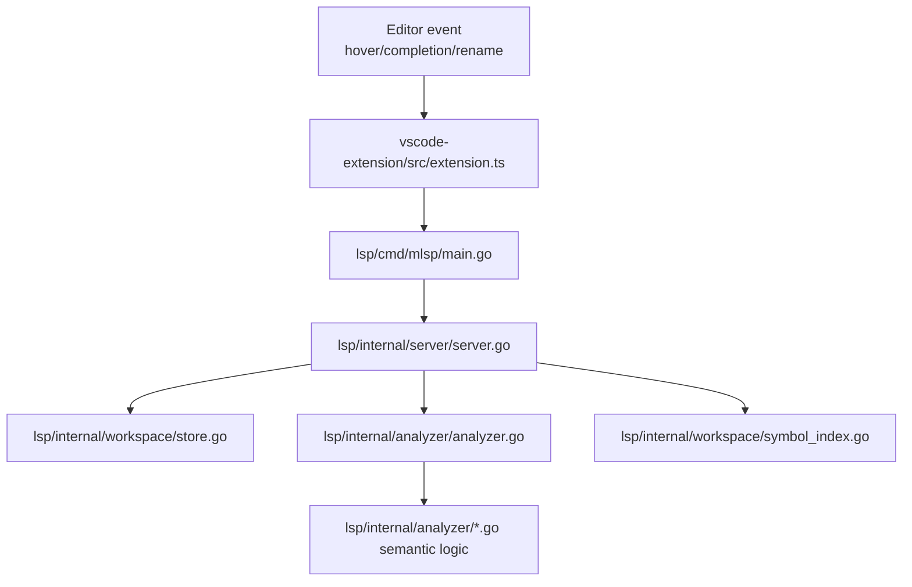

# Mutant LSP + VS Code Extension Onboarding in 60 Minutes

Last updated: 2026-07-10

This guide is a practical first-hour path for a junior engineer to understand,
run, debug, and safely modify Mutant language tooling.

Use this guide together with:

- [LSP + Extension LLD](LSP_EXTENSION_LLD.md)
- [VS Code LSP Teaching Reference](VSCODE_LSP_TEACHING_REFERENCE.md)
- [VS Code Extension Troubleshooting](VSCODE_EXTENSION_TROUBLESHOOTING.md)

## 1. Outcomes

By the end of 60 minutes, you should be able to:

- Explain the runtime chain: VS Code -> extension -> mlsp -> analyzer.
- Run all tooling tests confidently.
- Trace a completion/hover request from editor event to response payload.
- Add a tiny behavior change and verify with tests.

## 2. Prerequisites

- Go installed and working.
- Node.js and npm installed.
- Repository cloned locally.
- VS Code installed.

## 3. 60-Minute Agenda

| Time      | Goal                          | What to do                                                                                  |
| --------- | ----------------------------- | ------------------------------------------------------------------------------------------- |
| 0-10 min  | Build mental model            | Read architecture overview + capability map in [LSP_EXTENSION_LLD.md](LSP_EXTENSION_LLD.md) |
| 10-20 min | Run baseline tests            | Run Go server/analyzer tests and extension tests                                            |
| 20-35 min | Follow one request end-to-end | Trace completion flow from extension to analyzer                                            |
| 35-50 min | Make one safe change          | Modify non-breaking behavior, run targeted tests                                            |
| 50-60 min | Debug + operations confidence | Practice logs, status, restart, and smoke checks                                            |

## 4. Golden Path Commands

Run these from repository root unless noted.

### 4.1 Go language tooling tests

```bash
./lsp/build.sh --host-only
go test ./lsp/internal/analyzer -v
go test ./lsp/internal/server -v
go test ./...
```

```powershell
./lsp/build.ps1 -HostOnly
go test ./lsp/internal/analyzer -v
go test ./lsp/internal/server -v
go test ./...
```

### 4.2 VS Code extension tests

```bash
cd vscode-extension
npm install
npm run compile
npm test
```

### 4.3 Local extension host run

1. Open workspace in VS Code.
2. Press F5 to launch Extension Development Host.
3. Open a .mut file.
4. Run commands:

- Mutant: Show LSP Status
- Mutant: Show LSP Logs
- Mutant: Run LSP Smoke Checks

## 5. Architecture Map You Should Memorize



Read these files in this order:

1. [vscode-extension/src/extension.ts](../vscode-extension/src/extension.ts)
2. [lsp/cmd/mlsp/main.go](../lsp/cmd/mlsp/main.go)
3. [lsp/internal/server/server.go](../lsp/internal/server/server.go)
4. [lsp/internal/analyzer/analyzer.go](../lsp/internal/analyzer/analyzer.go)
5. [lsp/internal/analyzer/language_teach.go](../lsp/internal/analyzer/language_teach.go)
6. [lsp/internal/workspace/store.go](../lsp/internal/workspace/store.go)
7. [lsp/internal/workspace/symbol_index.go](../lsp/internal/workspace/symbol_index.go)

## 6. Guided Hands-On Exercises

### Exercise A: Trace completion end-to-end (10-12 min)

Goal: understand request flow and determinism.

1. Start with completion handler in
   [lsp/internal/server/server.go](../lsp/internal/server/server.go).
2. Follow call to Snapshot completion in
   [lsp/internal/analyzer/analyzer.go](../lsp/internal/analyzer/analyzer.go).
3. Identify ranking categories and SortText behavior.
4. Verify with test in
   [lsp/internal/server/server_test.go](../lsp/internal/server/server_test.go):
   completion and determinism tests.

What to learn:

- Why deterministic ordering prevents editor flicker and flaky tests.
- How visible scope bindings merge with keywords, builtins, and snippets.

### Exercise B: Trace hover and signature help (8-10 min)

Goal: understand teaching metadata path.

1. Start at server hover/signature handlers in
   [lsp/internal/server/server.go](../lsp/internal/server/server.go).
2. Follow to
   [lsp/internal/analyzer/analyzer.go](../lsp/internal/analyzer/analyzer.go) and
   [lsp/internal/analyzer/signature_help.go](../lsp/internal/analyzer/signature_help.go).
3. Open metadata definitions in
   [lsp/internal/analyzer/language_teach.go](../lsp/internal/analyzer/language_teach.go).

What to learn:

- Difference between rich builtin docs and fallback docs.
- Where to update keyword/builtin/snippet teaching behavior safely.

### Exercise C: Make one safe formatting tweak (10-12 min)

Goal: learn safe editing and regression checks.

1. Open [lsp/internal/server/formatter.go](../lsp/internal/server/formatter.go).
2. Read the preservation guards for comments and blank lines.
3. Make a tiny, non-destructive change (for example, adjust whitespace
   normalization helper only).
4. Run focused tests:

```bash
go test ./lsp/internal/server -run TestDocumentFormatting -v
```

What to learn:

- Why formatter has preservation-first behavior for comment/blank-line
  documents.
- How nil edits represent valid noop formatting.

## 7. First Real Feature Tasks (Pick One)

### Option 1: Add a new snippet

Edit:

- [lsp/internal/analyzer/language_teach.go](../lsp/internal/analyzer/language_teach.go)

Validate:

- completion tests in
  [lsp/internal/server/server_test.go](../lsp/internal/server/server_test.go)

### Option 2: Add a new builtin with teaching

Edit:

- [builtin/builtin.go](../builtin/builtin.go)
- optionally add rich docs in
  [lsp/internal/analyzer/language_teach.go](../lsp/internal/analyzer/language_teach.go)

Validate:

- builtin coverage regression in
  [lsp/internal/analyzer/analyzer_test.go](../lsp/internal/analyzer/analyzer_test.go)
- full Go tests

### Option 3: Add a lint rule

Edit:

- [lsp/internal/analyzer/diagnostics.go](../lsp/internal/analyzer/diagnostics.go)
- [lsp/internal/server/lint_config.go](../lsp/internal/server/lint_config.go)
- extension setting schema in
  [vscode-extension/package.json](../vscode-extension/package.json)

Validate:

- server tests for diagnostics/config updates in
  [lsp/internal/server/server_test.go](../lsp/internal/server/server_test.go)

## 8. Operational Playbook for Day 1

Use these commands in extension host when behavior seems wrong:

- Mutant: Show LSP Status
- Mutant: Show LSP Logs
- Mutant: Copy LSP Logs
- Mutant: Restart LSP

If startup fails repeatedly:

1. Check configured binary path setting.
2. Confirm latest local mlsp binary selection behavior.
3. Use troubleshooting steps in
   [VSCODE_EXTENSION_TROUBLESHOOTING.md](VSCODE_EXTENSION_TROUBLESHOOTING.md).

## 9. Common Pitfalls and How to Avoid Them

- Pitfall: relying on AST String methods for parser control flow.
- Avoid by: using structural nil-safe checks in parser/server logic.

- Pitfall: non-deterministic completion ordering.
- Avoid by: preserving canonical sort and SortText assignment.

- Pitfall: formatter unexpectedly collapsing authored spacing/comments.
- Avoid by: preserving guard path for comments/intentional blank lines.

- Pitfall: adding builtin runtime implementation but forgetting editor teaching
  quality.
- Avoid by: adding builtinDocs entry when possible and running builtin coverage
  tests.

## 10. Day-2 Checklist

- Read [LSP_EXTENSION_LLD.md](LSP_EXTENSION_LLD.md) sections 3, 4, 12 again.
- Run all tests without guidance.
- Implement one small feature with tests.
- Write a short note in PR description explaining request flow touched.

## 11. Suggested Mentor Review Rubric

A good first contribution should show:

- Correct file placement (server vs analyzer vs extension).
- Deterministic output behavior preserved.
- New/updated tests proving behavior.
- No regression in formatter preservation and diagnostics flows.
- Clear update to docs when developer-facing behavior changed.
