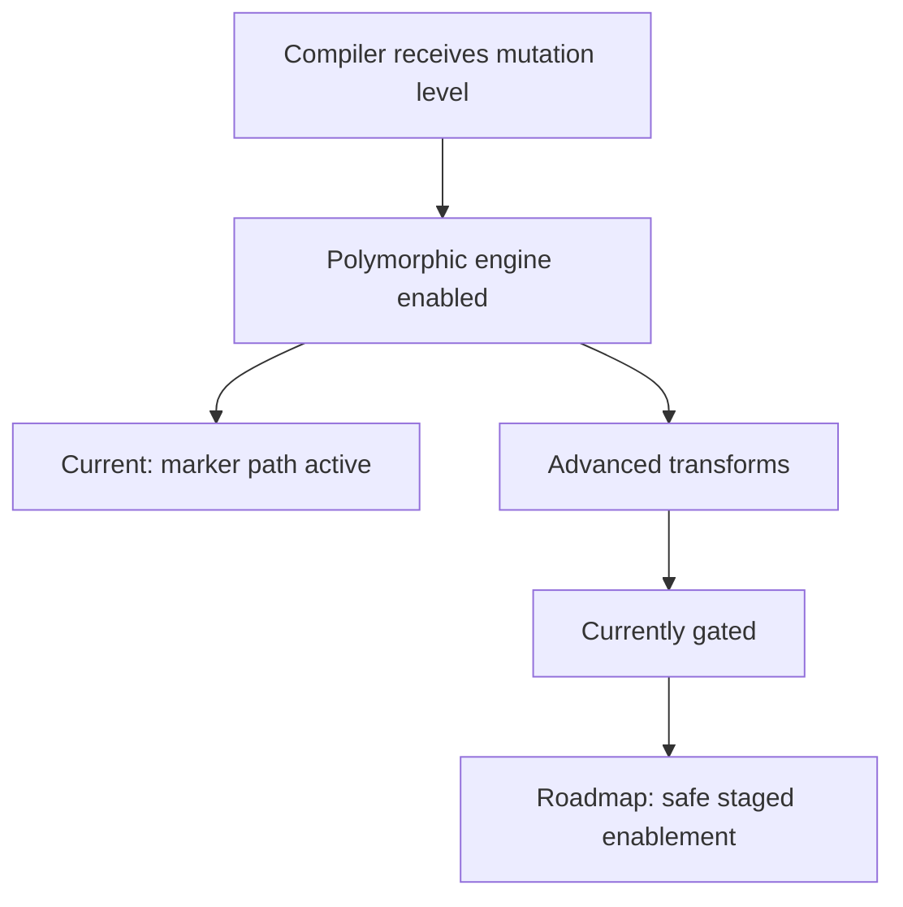

# Polymorphic Bytecode LLD (Current + Roadmap)

## 1. Purpose

This LLD explains the real status of Mutant polymorphic bytecode support and the
safe path to expand it.

## 2. Current Implementation

Core files:

1. `compiler/polymorphic.go`
2. `compiler/compiler.go`
3. `compiler/polymorphic_test.go`
4. `compiler/opcode_mapping_test.go`

Current behavior:

1. Polymorphic engine is integrated into compiler flow.
2. Mutation level and seed controls are wired via CLI compile paths.
3. Polymorphic marker/tagging is applied for non-zero mutation levels.
4. Advanced mutation transforms are currently gated by config in `getConfig()`.

## 3. Why transforms are gated

Reason: safety and compatibility.

1. Transforming instruction streams needs strict operand-boundary correctness.
2. Opcode remap needs reversible and VM-safe decoding strategy.
3. Constant pool remap needs complete reference correctness across nested
   compiled functions.

## 4. Current CLI Controls

Supported controls in compile/release workflows:

1. `-mutation <0-10>`
2. `-seed <int64>`

These controls are available today, even while advanced transforms remain
constrained.

## 5. Design for Full Activation

### Phase 1: Safe transform primitives

1. Enable and validate instruction-boundary aware NOP insertion.
2. Ensure no semantic change under nested control-flow scenarios.

### Phase 2: Constant remap hardening

1. Verify all constant references update correctly in root and nested functions.
2. Add stress tests on closures and composite literals.

### Phase 3: Opcode remap protocol

1. Define reversible mapping strategy.
2. Add robust VM compatibility handling.
3. Add fallback behavior for unsupported map versions.

## 6. Validation Strategy

Unit tests:

1. semantic equivalence tests for transformed bytecode
2. deterministic seed reproducibility tests
3. marker detection and stripping tests

Integration tests:

1. compile-run parity tests across mutation levels
2. cross-platform test matrix for deterministic behavior

## 7. Diagram

## 8. Student Takeaway

Polymorphism in this project is not all-or-nothing.

1. Framework is integrated now.
2. Some advanced transforms are intentionally gated for correctness and
   stability.
3. The roadmap is about safely increasing mutation depth without breaking VM
   semantics.
