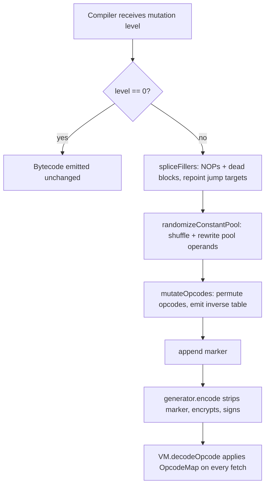

# Polymorphic Bytecode LLD (Current + Roadmap)

## 1. Purpose

This LLD explains the real status of Mutant polymorphic bytecode support and the
safe path to expand it.

## 2. Current Implementation

Core files:

1. `compiler/polymorphic.go` -- the transforms
2. `compiler/compiler.go` -- `ByteCode.OpcodeMap`, `Compiler.PolymorphicLevel()`
3. `code/code.go` -- `ConstantOperands`, `JumpOperands`, `AllOpcodes()`: what
   each transform is allowed to rewrite
4. `vm/vm.go` -- `VM.decodeOpcode`, `normalizeOpcodeMap`: the reversal
5. `generator/generate.go` -- marker stripping, driven by the level the compiler
   reports rather than by reading the bytes
6. Tests: `compiler/polymorphic_test.go`, `compiler/polymorphic_nop_test.go`,
   `compiler/polymorphic_opcode_map_test.go`, `compiler/opcode_mapping_test.go`,
   `vm/polymorphic_opcode_map_test.go`, `vm/polymorphic_constant_pool_test.go`,
   `code/constant_operands_test.go`

Current behavior:

1. Polymorphic engine is integrated into compiler flow.
2. Mutation level and seed controls are wired via CLI compile paths.
3. Polymorphic marker/tagging is applied for non-zero mutation levels, and
   removed by `generator.encode` before anything is written.
4. **All four transforms run at any non-zero mutation level**, in this order,
   which is load-bearing:
   1. Filler insertion (`spliceFillers`) -- every stream, jump targets
      repointed. Two stages share this pass: NOP insertion emits a block that
      runs and does nothing, dead-code insertion emits one that is branched
      over and never runs at all. They differ in what they generate and in
      nothing else, so decoding boundaries and rewriting jumps happens once
      rather than twice.
   2. Constant-pool randomization (`randomizeConstantPool`) -- pool operands
      rewritten
   3. Opcode remapping (`mutateOpcodes`) -- **last**, because the first two walk
      the stream by operand width and need the opcode bytes to still mean what
      `code.Lookup` says
5. `ReorderInstructions` has been removed from `MutationConfig`. Reordering
   needs a reverse mapping the VM has no way to carry, and a named stage with
   nothing behind it is how a stale opcode list once survived unnoticed.

## 3. What each transform needed before it could be enabled

Reason each was gated: safety and compatibility. All of them have been paid
for.

**NOP insertion** needed instruction-boundary-aware splicing *and* jump-target
rewriting. `OpJump`/`OpJumpFalse` carry absolute offsets (`code.JumpOperands`),
so a single inserted byte ahead of a target redirects it into the middle of an
instruction, which the VM's control-flow integrity check reports as tampering.
The old implementation walked bytes rather than instructions, never touched a
jump operand, drew from `crypto/rand` (so `--seed` could not reproduce a build),
and included a bare `OpPop` variant that discarded a live stack value. All four
are fixed; a stream that cannot be safely padded is returned untouched.

**Dead-code insertion** needed the same machinery, which is why it is enabled
now and was not before: it splices at instruction boundaries and moves
everything after it, exactly as NOP insertion does. What is specific to it is
that the block it emits carries a jump of its own, and that jump targets an
offset which exists only in the padded stream. The rewriting pass resolves
every jump operand through a map keyed by *original* offsets, so left to
itself it would fail on the injected one -- silently returning the stream
unpadded -- or, if the map were seeded with identity entries to avoid that,
collide with a real old offset and redirect the branch into live code.
`padInstructions` therefore records the operand offsets it writes and excludes
them; their targets are already final. The junk itself is drawn only from
operand-free opcodes, so it decodes at a fixed width for every later pass and
cannot carry an index pointing outside the program.

**Opcode remapping** needed a reversible mapping and a VM that applies it. The
inverse now ships in `ByteCode.OpcodeMap` (256 entries, gob-encoded with the
program) and `VM.decodeOpcode` applies it at all three sites that turn a byte
into an opcode: the fetch loop, the instruction-boundary map, and the
security-opcode scan. The rewrite itself now walks by operand width -- it used
to walk byte by byte and rewrite operand bytes whose value happened to equal an
opcode.

**Constant-pool remap** needed complete reference correctness across every
operand that indexes the pool, including inside nested compiled functions -- and
it shipped without it: only `OpConstant` was rewritten, so `OpClosure`,
`OpMakeStruct`, `OpGetField`, `OpSetField` and `OpEnumValue` were left pointing
at whatever the shuffle had moved into their old slots. Programs using
functions, structs or enums compiled without complaint at `--mutation 6` and
above, then failed inside the VM with `not a function` or `type constant is not
string`.

The operand sets come from `code.ConstantOperands` and `code.JumpOperands`, and
`TestWideOperandsAreClassified` forces every new two-byte operand to be
classified as one, the other, or explicitly neither.

## 4. Current CLI Controls

Supported controls in compile/release workflows:

1. `-mutation <0-10>`
2. `-seed <int64>`

`--mutation 0` disables the engine entirely. Any other value engages all four
transforms; the level scales filler density (`level x 1.5%` of instruction
boundaries), which is the one graded dimension.

`--seed` reproduces the **bytecode**, not the file. Two builds of one source
at one seed produce identical instructions and constants at every mutation
level; the `.mu` around them still differs every time, because it is sealed
with AES-GCM under a fresh salt and nonce and repeating a GCM nonce under one
key is a break. Without `--seed` the seed is the current time, so the bytecode
differs too.

The seed also places the injected `OpChkDbg`/`OpChkSnd` checks, which is newer
than it sounds: that placement used to be drawn from `crypto/rand` and reached
by no seed at all, so `--seed` did not reproduce a build even at `--mutation 0`
where no transform runs. It is the same defect NOP insertion had, in the one
part of the pipeline nobody looked at because it is not a mutation stage.
(`TestTheSameSeedProducesTheSameBytecodeAtEveryLevel`.)

## 5. What is left

The three roadmap phases this section used to list are done. What remains is not
transform work:

1. **Instruction reordering is not implemented and will not be.** It needs
   basic-block analysis rather than a rewrite pass -- the stream is not a flat
   list of independent instructions -- and a reverse mapping the VM has no way
   to carry. The config field has been removed rather than left switched off.
2. **The `.mu` format has no version negotiation.** A remapped file handed to a
   runtime that predates `OpcodeMap` decodes the field away and runs the wrong
   instructions. Standalone releases embed their runtime and are inherently
   matched; loose `.mu` files are not.

## 6. Validation Strategy

Unit tests:

1. semantic equivalence tests for transformed bytecode
   (`TestRemappedProgramRunsThroughTheVM`, levels 0-10, over a program with
   loops, conditionals, closures, structs and enums)
2. deterministic seed reproducibility tests
   (`TestPaddingIsReproducibleFromTheSeed`, `TestOpcodeMappingDeterministic`)
3. jump-target correctness (`TestPaddingRepointsJumpTargets`,
   `TestPaddedJumpsLandOnInstructionBoundaries`)
4. opcode round-trip through the inverse table (`TestReverseTableUndoesTheRewrite`)
5. operand bytes are not rewritten (`TestRemappingLeavesOperandBytesAlone`)
6. the inverse table is load-bearing
   (`TestARemappedProgramNeedsItsReverseTable`)
7. the security-opcode scan sees through the remapping
   (`TestRemappedProgramStillPassesTheSecurityOpcodeScan`)
8. dead blocks are branched over and their injected jumps survive the
   repointing pass (`TestEveryDeadBlockIsJumpedOverEndToEnd`,
   `TestAnInjectedJumpIsNotRepointedByTheOriginalJumpPass`) -- removing the
   exclusion makes three of these fail, which is what pins it
9. bytecode the VM cannot decode is an error rather than a panic, on every
   entry point (`vm/fault_test.go`)

Integration tests:

1. compile-run parity tests across mutation levels
2. cross-platform test matrix for deterministic behavior

## 7. Diagram

```mermaid
flowchart TD
    A[Compiler receives mutation level] --> B{level == 0?}
    B -->|yes| Z[Bytecode emitted unchanged]
    B -->|no| C[spliceFillers: NOPs + dead blocks, repoint jump targets]
    C --> D[randomizeConstantPool: shuffle + rewrite pool operands]
    D --> E[mutateOpcodes: permute opcodes, emit inverse table]
    E --> F[append marker]
    F --> G[generator.encode strips marker, encrypts, signs]
    G --> H[VM.decodeOpcode applies OpcodeMap on every fetch]
```

## 8. Student Takeaway

The interesting lesson here is not the obfuscation, it is the failure mode.

1. Every one of these transforms fails **silently**. A stale jump target, a
   mis-rewritten operand, a pool index left behind -- none of them is a crash at
   rewrite time. The program compiles clean and misbehaves much later, somewhere
   else, in the VM.
2. So each transform is paired with a table that names exactly what it may touch
   (`code.ConstantOperands`, `code.JumpOperands`), and a test that refuses to
   let a new opcode past without being classified.
3. A transform that cannot prove it is safe on a given stream declines to touch
   it. Returning the input unchanged is always available; a half-rewritten
   stream is not recoverable.
