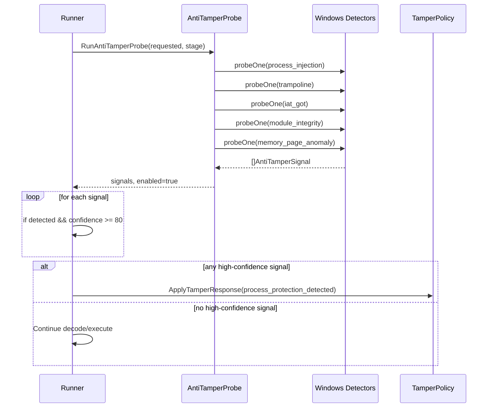
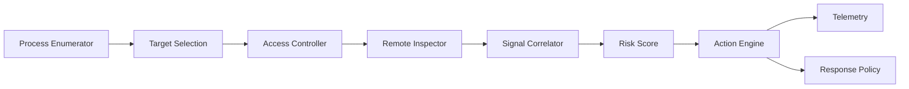
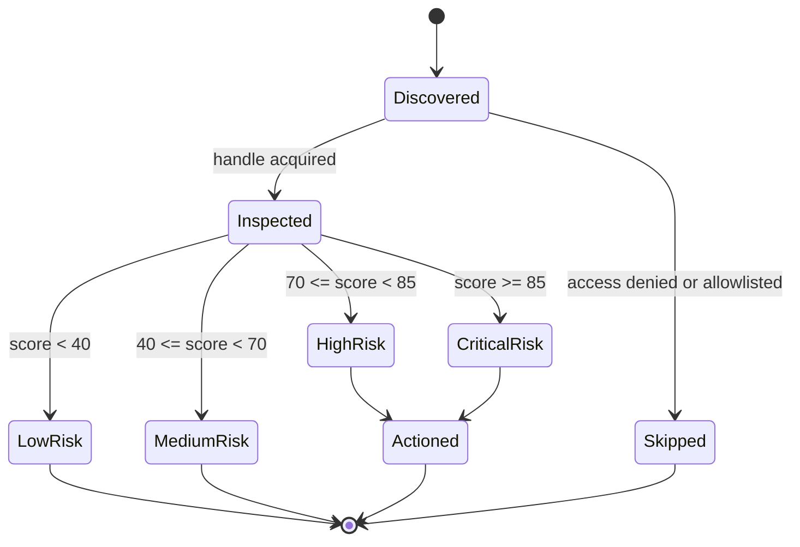
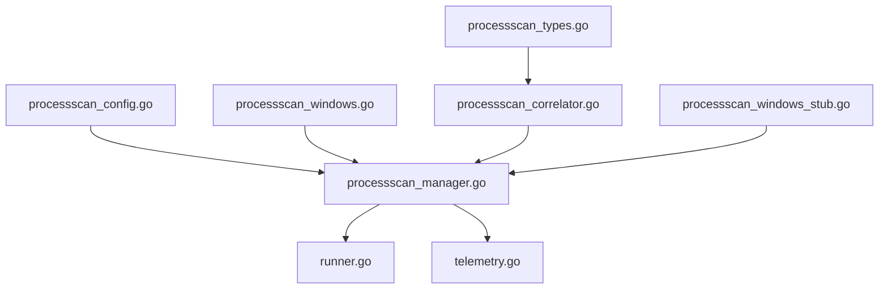

# Process Injection Detection LLD

## 1. Purpose

This Low Level Design (LLD) explains how Mutant currently detects process
injection-related tampering and how to expand this into a richer, multi-process
detector in the future.

Primary goals:

1. Explain what is implemented today.
2. Explain why it works and where it is weak.
3. Propose a robust future design for scanning other processes when the agent
   has enough privileges.

---

## 2. Scope

In scope:

- Windows process-injection related anti-tamper probes.
- Runner-side enforcement and confidence thresholding.
- Future architecture for cross-process detection.
- Data model, scoring, and rollout plan.

Out of scope:

- Offensive code or exploit implementation.
- Kernel driver implementation.
- Full EDR product design.

---

## 3. Current Implementation Summary

### 3.1 Where the logic lives

- Probe router: security/antitamper_routing.go
- Probe engine: security/antitamper_probe.go
- Windows probe implementations: security/antitamper_windows.go
- Probe names and confidences: security/antitamper_constants.go
- Runner enforcement: runner/runner.go
- Process protection env gate: security/const.go

### 3.2 Process-protection probe set in runner

Runner currently checks this set before decode and before execution:

1. process_injection
2. trampoline
3. iat_got
4. module_integrity
5. memory_page_anomaly

Diagnostic note:

- This 5-probe set is used for runner enforcement only.
- Builtin diagnostics (for example `security_status` builtins) invoke broader
  probe lists for observability and troubleshooting.

Enforcement condition:

- If any signal has detected=true and confidence >= 80, runner treats it as
  process protection event and applies tamper policy.

Gates:

- MUTANT_ENABLE_ANTITAMPER_PROBE=1 must be enabled.
- MUTANT_ENABLE_PROCESS_PROTECTION controls runner-side enforcement.

---

## 4. Current Detection Internals (Windows)

### 4.1 Probe: process_injection

Function: detectProcessInjection()

Signal sources:

1. Environment markers
   - COR_ENABLE_PROFILING
   - COR_PROFILER
   - COR_PROFILER_PATH
   - JAVA_TOOL_OPTIONS
   - _NT_SYMBOL_PATH
2. Process list markers via tasklist output
   - processhacker
   - x64dbg
   - ollydbg
   - cheat engine
   - frida
   - dnspy

Confidence strategy:

- Base marker hit: 70
- Environment-only hit: 90
- Env + process hit: 95

### 4.2 Probe: trampoline

Function: detectTrampoline()

Target APIs include selected ntdll and kernel32 exports such as NtOpenProcess,
NtWriteVirtualMemory, NtCreateThreadEx, CreateRemoteThread.

Method:

1. Resolve function address.
2. Read first bytes of function prologue.
3. Match common hook trampoline signatures:
   - Relative JMP/CALL
   - Indirect JMP pattern
   - movabs+jmp register pattern

Confidence:

- One hit: 75
- Multi-hit (>=2): 90

### 4.3 Probe: iat_got

Function: detectIATGOT()

Method:

1. Resolve sensitive exports from ntdll.
2. Query memory info for each resolved address.
3. Compare allocation base with expected module handle.
4. If base differs, export may be redirected/hooked.

Confidence:

- Redirected export hit: 90

### 4.4 Probe: module_integrity

Function: detectModuleIntegrity()

Method:

1. Check whether suspicious instrumentation DLL markers are loaded.
2. Example markers include frida and detour-style module names.

Confidence:

- Suspicious module marker hit: 85

### 4.5 Probe: memory_page_anomaly

Function: detectMemoryPageAnomaly()

Method:

1. Resolve addresses of selected sensitive APIs.
2. Query memory protection for those addresses.
3. Flag when code pages are RWX (PAGE_EXECUTE_READWRITE).

Confidence:

- RWX anomaly hit: 92

---

## 5. Current End-to-End Flow



---

## 6. Why this design is useful

1. Fast and low-overhead.
2. Cross-checks different evidence types (env/process/hooks/pages/modules).
3. Confidence model avoids hard fail on weak single marker.
4. Runner enforces policy at two useful stages.

---

## 7. Current Gaps and Limitations

1. Mostly self-process visibility, not full ecosystem visibility.
2. Marker-based checks can have false positives.
3. tasklist string matching is coarse.
4. No deep remote-process memory/thread correlation yet.
5. No baseline learning per process image hash.

---

## 8. Future Expansion: Other Processes (Assume Required Privileges)

If we have sufficient privileges (for example, SeDebugPrivilege where needed),
we can extend from self-protection to host-level process injection detection.

### 8.1 Design principles

1. Least privilege first, escalate only when necessary.
2. Multi-signal correlation, not single-signature verdicts.
3. Safe-by-default: detection mode first, enforcement later.
4. Explainability: every verdict must contain evidence.

### 8.2 Proposed architecture components

1. ProcessEnumerator
   - Enumerate process IDs and metadata.
2. AccessController
   - Acquire handles with minimal rights.
   - Escalate rights only for deeper checks.
3. RemoteInspector
   - Module map checks.
   - Memory region checks via VirtualQueryEx.
   - Thread start address checks.
4. SignalCorrelator
   - Aggregate evidence and compute confidence.
5. ActionEngine
   - Emit telemetry.
   - Apply policy (warn, isolate, terminate) per mode.



### 8.3 Remote inspection heuristics for other processes

When allowed by rights and policy:

1. Process metadata signals
   - Parent-child anomalies.
   - Unexpected image path or signer mismatch.
2. Module signals
   - Unsigned or untrusted modules in sensitive processes.
   - User-writable path DLLs loaded into high-trust processes.
3. Memory signals
   - RWX private regions.
   - RX private regions without mapped image backing.
4. Thread signals
   - Thread start address inside suspicious private pages.
   - Start address not inside known module boundaries.
5. API-hook signals
   - Prologue patch patterns in key exports.
   - IAT/GOT redirection anomalies.

### 8.4 Suggested confidence model for multi-process expansion

Use weighted additive scoring and cap at 100.

Example weights:

- Suspicious env or tool markers: +20
- Hook prologue hit on critical API: +25
- IAT/GOT redirection hit: +30
- RWX private executable region: +30
- Thread start in private executable memory: +35
- Unsigned injected module in trusted process: +35

Then convert score to action bands:

1. 0-39: informational
2. 40-69: suspicious, monitor only
3. 70-84: high risk, block sensitive actions
4. 85-100: critical, hard response as per policy

### 8.5 Data model proposal

```go
type RemoteProcessSignal struct {
    ProcessID   uint32
    ProcessName string
    SignalName  string
    Detected    bool
    Confidence  int
    Evidence    map[string]string
    Timestamp   int64
}

type ProcessRiskVerdict struct {
    ProcessID   uint32
    FinalScore  int
    RiskBand    string
    Signals     []RemoteProcessSignal
}
```

### 8.6 Scan loop pseudocode

```text
for each process in enumerateProcesses():
    h = openProcessWithLeastPrivilege(process)
    if h unavailable:
        continue

    signals = []
    signals += checkModuleAnomalies(h)
    signals += checkMemoryRegions(h)
    signals += checkThreadStartAddresses(h)
    signals += checkHookPatterns(h)

    verdict = correlate(signals)
    emitTelemetry(verdict)
    applyPolicyIfNeeded(verdict)
```

### 8.7 State machine for one process



---

## 9. Integration Plan for Mutant Codebase

Recommended phased rollout:

### Phase 1: Refactor and abstraction

1. Extract existing process-protection probes behind a detector interface.
2. Keep current behavior unchanged.
3. Add structured evidence fields to signal detail.

### Phase 2: Multi-process read-only detector

1. Add process enumerator and remote inspectors in observe-only mode.
2. Emit telemetry only, no enforcement.
3. Tune confidence weights with test datasets.

### Phase 3: Controlled enforcement

1. Add policy bands for remote-process verdicts.
2. Enable enforcement only in secure mode or explicit opt-in.
3. Keep allowlist support for enterprise compatibility tools.

### Phase 4: Performance and quality hardening

1. Sampling and rate limiting.
2. Baseline cache by process image hash.
3. Differential scanning to avoid repeated full scans.

---

## 10. Testing Strategy

### 10.1 Unit tests

1. Signature parsers and prologue matchers.
2. Confidence scoring math.
3. Correlator risk-band boundaries.

### 10.2 Integration tests

1. Mock process table and module maps.
2. Validate scanner behavior on access denied.
3. Validate action decisions for synthetic signal combinations.

### 10.3 Performance tests

1. Scan latency per N processes.
2. CPU and memory overhead budget.
3. Telemetry volume under burst conditions.

---

## 11. Security and Safety Notes

1. Keep strict audit logs for every high-risk verdict.
2. Never auto-kill critical system processes without policy safeguards.
3. Use signed allowlists for known-good enterprise agents.
4. Prefer deterministic evidence over opaque black-box scoring.

---

## 12. Practical Student Takeaway

If you remember one thing: strong process injection detection is not one magic
API call. It is a pipeline:

1. gather multiple low-level signals,
2. correlate them into confidence,
3. apply a clear policy based on operating mode,
4. keep observability for debugging and tuning.

That is exactly the direction this design follows.

---

## 13. Companion Implementation Blueprint (Code-Level)

This section maps the future architecture to concrete files, interfaces,
function signatures, and rollout tasks inside this repository.

### 13.1 Proposed file map (new and existing)

Reuse existing files:

1. security/antitamper_probe.go
2. security/antitamper_routing.go
3. security/antitamper_constants.go
4. security/telemetry.go
5. runner/runner.go

Add new files (recommended):

1. security/processscan_types.go
2. security/processscan_config.go
3. security/processscan_correlator.go
4. security/processscan_manager.go
5. security/processscan_windows.go
6. security/processscan_windows_stub.go
7. security/processscan_windows_test.go
8. security/processscan_correlator_test.go

Why this split:

1. Keep Windows syscall/API interactions isolated.
2. Keep scoring logic platform-agnostic and testable.
3. Keep manager/orchestration independent from detection primitives.

### 13.2 Proposed domain model (security/processscan_types.go)

Status: implemented (with current fields in code).

```go
package security

type SignalSource string

const (
   SignalSourceEnv      SignalSource = "env"
   SignalSourceProcess  SignalSource = "process"
   SignalSourceModule   SignalSource = "module"
   SignalSourceMemory   SignalSource = "memory"
   SignalSourceThread   SignalSource = "thread"
   SignalSourceHook     SignalSource = "hook"
)

type RemoteProcessTarget struct {
   PID         uint32
   Name        string
   ImagePath   string
   ParentPID   uint32
   SessionID   uint32
   IsProtected bool
}

type RemoteProcessSignal struct {
   PID        uint32
   Name       string
   Source     SignalSource
   SignalName string
   Detected   bool
   Weight     int
   Evidence   map[string]string
}

type ProcessRiskVerdict struct {
   PID        uint32
   Name       string
   FinalScore int
   RiskBand   string
   Signals    []RemoteProcessSignal
}
```

### 13.3 Config and env gates (security/processscan_config.go)

Current env vars:

1. MUTANT_ENABLE_REMOTE_PROCESS_SCAN
2. MUTANT_REMOTE_SCAN_MODE (off, observe, enforce)
3. MUTANT_REMOTE_SCAN_MAX_PROCESSES
4. MUTANT_REMOTE_SCAN_INTERVAL_MS
5. MUTANT_REMOTE_SCAN_ALLOWLIST

Suggested struct:

```go
type RemoteScanConfig struct {
   Enabled       bool
   Mode          string // off|observe|enforce
   MaxProcesses  int
   IntervalMs    int
   Allowlist     map[string]struct{}
   HighRiskScore int
   CriticalScore int
}
```

### 13.4 Correlator contract (security/processscan_correlator.go)

Status: implemented and covered by unit tests.

```go
func CorrelateProcessSignals(target RemoteProcessTarget, signals []RemoteProcessSignal) ProcessRiskVerdict
```

Rules:

1. Sum weights only for detected=true signals.
2. Cap final score at 100.
3. Assign risk bands:
   - score < 40 => low
   - 40 <= score < 70 => medium
   - 70 <= score < 85 => high
   - score >= 85 => critical
4. Keep all evidence in verdict for explainability.

### 13.5 Windows scanner contract (security/processscan_windows.go)

```go
type ProcessEnumerator interface {
   ListTargets(cfg RemoteScanConfig) ([]RemoteProcessTarget, error)
}

type RemoteInspector interface {
   InspectTarget(target RemoteProcessTarget, cfg RemoteScanConfig) ([]RemoteProcessSignal, error)
}

func ScanRemoteProcessesWindows(cfg RemoteScanConfig) ([]ProcessRiskVerdict, error)
```

Current implementation notes:

1. Scanner hook and contract are implemented.
2. Current windows scanner returns empty verdicts (`nil, nil`) as safe no-op.
3. Enumerator/inspector depth remains planned work.

### 13.6 Cross-platform stub (security/processscan_windows_stub.go)

Build tag: !windows

Behavior:

1. Return empty verdict list.
2. Return nil error.
3. Keep caller flow simple and safe.

### 13.7 Manager/orchestration (security/processscan_manager.go)

Current API:

```go
func RunRemoteProcessScan(stage string) ([]ProcessRiskVerdict, bool, error)
```

Behavior:

1. Parse config and check gates.
2. If disabled, return enabled=false.
3. Run platform scanner.
4. Emit telemetry per verdict.
5. Return results for runner policy integration.

### 13.8 Runner integration plan (runner/runner.go)

Status: implemented.

Add one function call in enforcement pipeline after existing
enforceProcessProtection:

```go
func enforceRemoteProcessProtection(secureMode bool, stage string) error
```

Decision model:

1. observe mode:
   - record telemetry only
   - never block execution
2. enforce mode:
   - if any verdict score >= critical threshold, apply tamper response
   - if high threshold only, optionally warn or delay by policy

### 13.9 Telemetry schema extension (security/telemetry.go)

Current event names:

1. remote_process_scan_invoked
2. remote_process_scan_error
3. remote_process_suspicious
4. remote_process_critical

Recommended fields:

1. stage
2. pid
3. process_name
4. score
5. risk_band
6. top_signals

### 13.10 Test blueprint

Unit tests:

1. processscan_correlator_test.go
   - score caps
   - risk band boundaries
   - empty signal set behavior
2. processscan_config parsing tests
   - invalid mode fallback
   - max process defaults

Windows tests:

1. processscan_windows_test.go
   - mocked enumerator/inspector behavior
   - access denied path
   - no targets path

Runner tests:

1. new tests in runner/runner_test.go
   - observe mode does not block
   - enforce mode blocks on critical verdict

### 13.11 Incremental delivery checklist

Sprint A (scaffolding):

1. Add types/config/correlator with tests. [done]
2. Add manager with no-op windows scanner. [done]
3. Add telemetry wiring. [done]

Sprint B (read-only scanner):

1. Implement enumeration + one inspector (modules).
2. Enable observe mode only.
3. Collect metrics in CI and staging.

Sprint C (full signal set):

1. Add memory/thread/hook inspectors.
2. Tune scoring against false-positive datasets.
3. Publish calibration notes in docs.

Sprint D (enforcement):

1. Enable enforce mode behind env gate. [done]
2. Roll out to secure profile first. [in progress]
3. Keep emergency kill-switch env var. [done via mode/off gate]

### 13.13 Deep-dive reference

For a code-accurate deep dive on current remote-scan architecture and behavior,
see:

1. [REMOTE_PROCESS_SCAN_DEEP_DIVE.md](REMOTE_PROCESS_SCAN_DEEP_DIVE.md)

### 13.12 Mermaid implementation dependency graph



### 13.13 Practical coding tip for this repo

Follow the same OS pattern already used in security package:

1. Keep Windows implementation in *_windows.go.
2. Keep !windows stubs returning safe defaults.
3. Keep routing and policy logic in OS-agnostic files.

This will preserve build stability and avoid cross-platform regressions.
