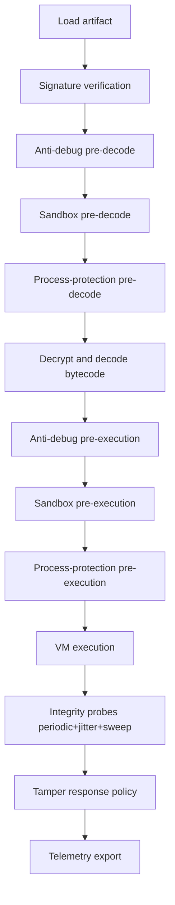
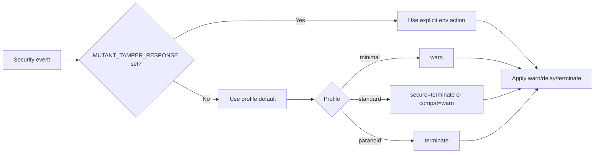
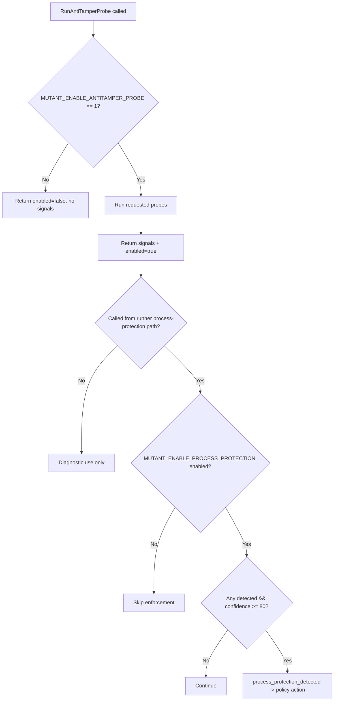
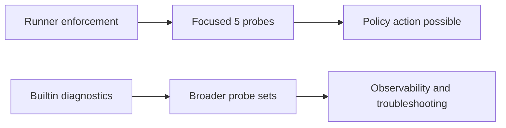
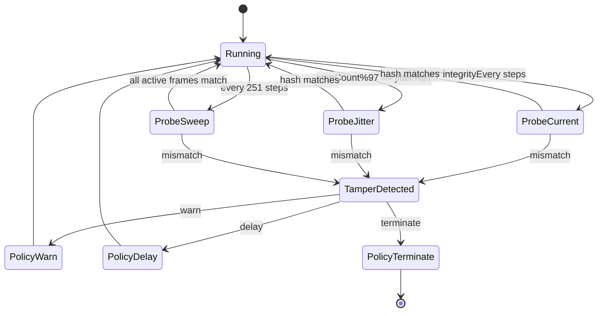
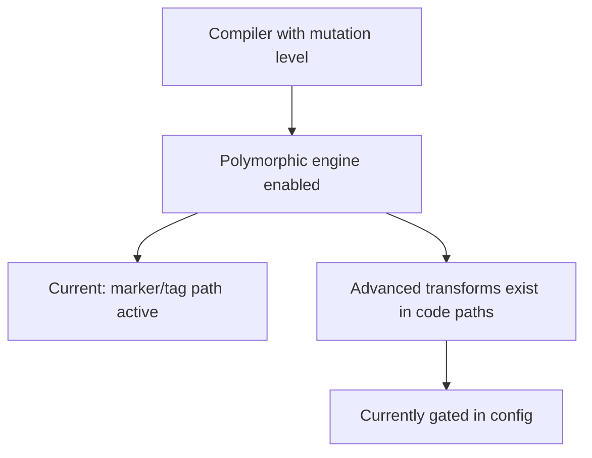

# Security Architecture Diagrams (Code-Synced)

## 1. End-to-End Runtime Security Flow

## 2. Policy Decision Flow

## 3. Anti-Tamper Probe Gates

## 4. Runner vs Builtin Probe Scope

## 5. VM Integrity Scheduling

## 6. Polymorphic Engine Reality Snapshot

Note:

1. Mutation controls and seed are wired through CLI.
2. Advanced transform activation is intentionally constrained in current
   configuration.
