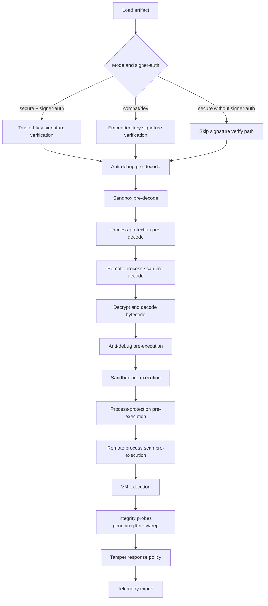
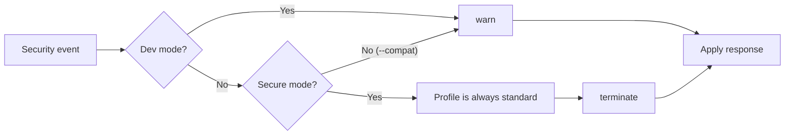
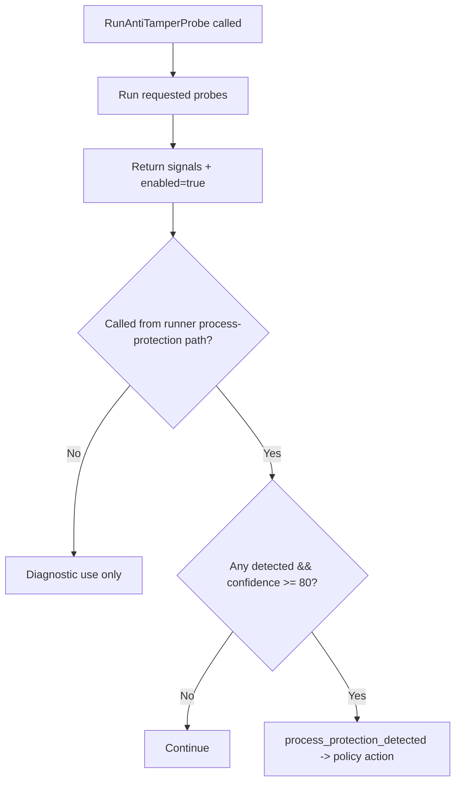
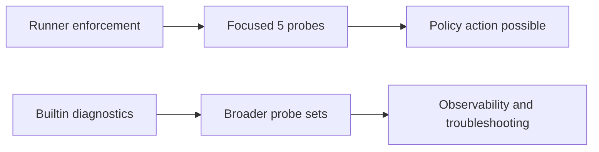
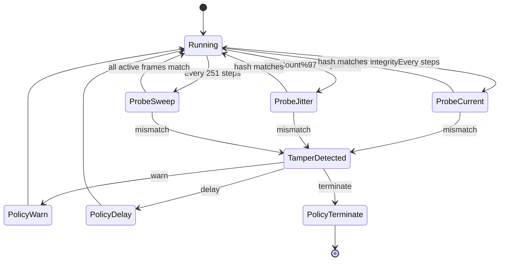
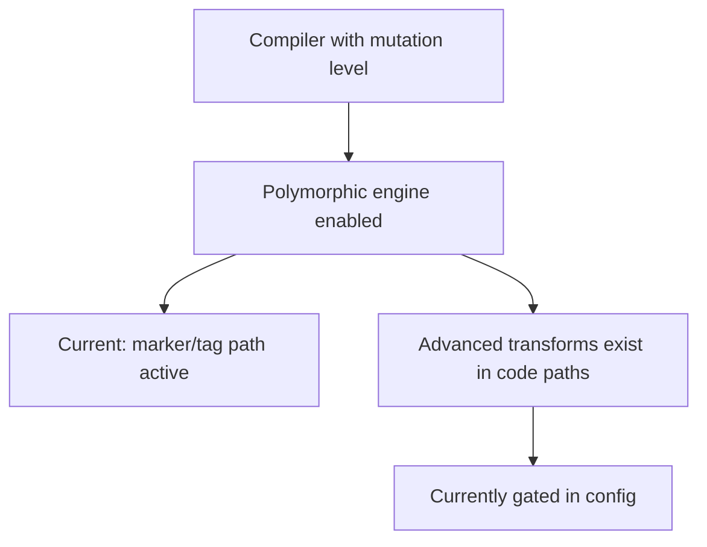
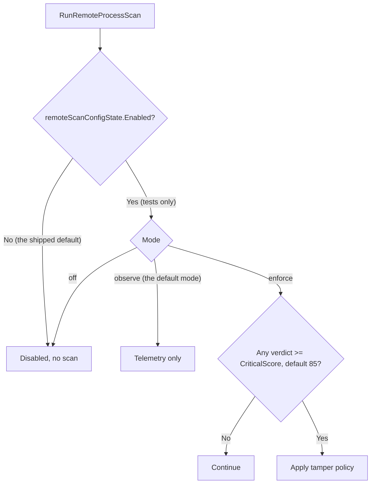
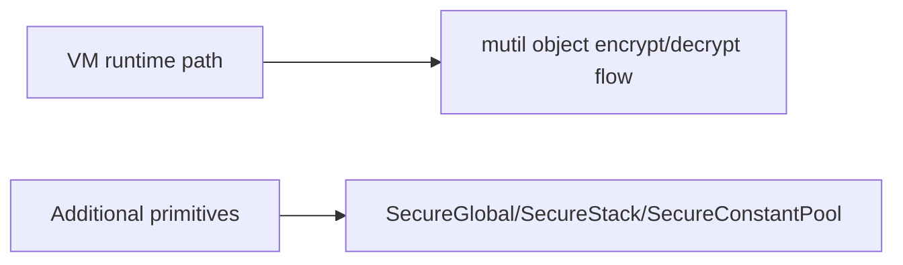

# Security Architecture Diagrams (Code-Synced)

Visual reference for how Mutant's runtime security pipeline, policy
decisions, and probe gates fit together, kept in sync with current code
behavior.

## 1. End-to-End Runtime Security Flow

```mermaid
flowchart TD
    A[Load artifact] --> B{Mode and signer-auth}
    B -->|secure + signer-auth| C[Trusted-key signature verification]
    B -->|compat/dev| D[Embedded-key signature verification]
    B -->|secure without signer-auth| E[Skip signature verify path]
    C --> F[Anti-debug pre-decode]
    D --> F
    E --> F
    F --> G[Sandbox pre-decode]
    G --> H[Process-protection pre-decode]
    H --> I[Remote process scan pre-decode]
    I --> J[Decrypt and decode bytecode]
    J --> K[Anti-debug pre-execution]
    K --> L[Sandbox pre-execution]
    L --> M[Process-protection pre-execution]
    M --> N[Remote process scan pre-execution]
    N --> O[VM execution]
    O --> P[Integrity probes periodic+jitter+sweep]
    P --> Q[Tamper response policy]
    Q --> R[Telemetry export]
```

## 2. Policy Decision Flow

```mermaid
flowchart LR
    A[Security event] --> B{Dev mode?}
    B -->|Yes| C[warn]
    B -->|No| D{Secure mode?}
    D -->|"No (--compat)"| C
    D -->|Yes| E[Profile is always standard]
    E --> F[terminate]
    C --> G[Apply response]
    F --> G
```

The response is a pure function of the execution mode from argv:
`ResolveTamperResponse(secureMode)` in `security/response_policy.go`. There is
no override, and the profile diamond the earlier version of this diagram carried
is gone -- `ResolveProtectionProfile()` returns the constant `standard`, so the
`minimal` and `paranoid` branches are unreachable at runtime. They remain in
`ProtectionProfileFromCode` only so a V3 release trailer can be read back. The
`delay` response (`DefaultTamperDelayMs = 250`) is reachable through
`ApplyTamperResponse` but no mode selects it. See
[CONFIGURATION_POLICY.md](CONFIGURATION_POLICY.md).

## 3. Anti-Tamper Probe Gates

```mermaid
flowchart TD
    A[RunAntiTamperProbe called] --> B[Run requested probes]
    B --> C[Return signals + enabled=true]

    C --> D{Called from runner process-protection path?}
    D -->|No| E[Diagnostic use only]
    D -->|Yes| F{Any detected && confidence >= 80?}
    F -->|No| G[Continue]
    F -->|Yes| H[process_protection_detected -> policy action]
```

Both gates this diagram used to test are compile-time constants:
`antiTamperProbeEnabled` is `true` and `isProcessProtectionEnabled()` returns
`true`. Their `false` arms exist only for tests, which replace them directly.
The confidence threshold is the sole remaining decision on the enforcement path.
See [ANTITAMPER_PROBE_ENABLEMENT_LLD.md](ANTITAMPER_PROBE_ENABLEMENT_LLD.md).

## 4. Runner vs Builtin Probe Scope

```mermaid
flowchart LR
    A[Runner enforcement] --> B[Focused 5 probes]
    C[Builtin diagnostics] --> D[Broader probe sets]
    B --> E[Policy action possible]
    D --> F[Observability and troubleshooting]
```

## 5. VM Integrity Scheduling

```mermaid
stateDiagram-v2
    [*] --> Running
    Running --> ProbeCurrent: every integrityEvery steps
    Running --> ProbeJitter: stepCount%97 == jitter%97
    Running --> ProbeSweep: every 251 steps

    ProbeCurrent --> Running: hash matches
    ProbeJitter --> Running: hash matches
    ProbeSweep --> Running: all active frames match

    ProbeCurrent --> TamperDetected: mismatch
    ProbeJitter --> TamperDetected: mismatch
    ProbeSweep --> TamperDetected: mismatch

    TamperDetected --> PolicyWarn: warn
    TamperDetected --> PolicyDelay: delay
    TamperDetected --> PolicyTerminate: terminate

    PolicyWarn --> Running
    PolicyDelay --> Running
    PolicyTerminate --> [*]
```

## 6. Polymorphic Engine Reality Snapshot

```mermaid
flowchart TD
    A[Compiler with mutation level] --> B[Polymorphic engine enabled]
    B --> C[Current: marker/tag path active]
    B --> D[Advanced transforms exist in code paths]
    D --> E[Currently gated in config]
```

Note:

1. Mutation controls and seed are wired through CLI.
2. Advanced transform activation is intentionally constrained in current
   configuration.

## 7. Remote Scan Gate Model

```mermaid
flowchart TD
    A[RunRemoteProcessScan] --> B{remoteScanConfigState.Enabled?}
    B -->|"No (the shipped default)"| C[Disabled, no scan]
    B -->|"Yes (tests only)"| D{Mode}
    D -->|off| C
    D -->|"observe (the default mode)"| E[Telemetry only]
    D -->|enforce| F{Any verdict >= CriticalScore, default 85?}
    F -->|No| G[Continue]
    F -->|Yes| H[Apply tamper policy]
```

`remoteScanConfigState` (`security/processscan_config.go`) ships as
`Enabled: false, Mode: observe`, and the only way to change it is
`SetRemoteScanConfigForTesting`. Remote process scanning therefore never runs in
a shipped binary. The `Enabled: true` arms are drawn because the code is
exercised by tests, not because an operator can reach them; there is no flag for
it yet. See [CONFIGURATION_POLICY.md](CONFIGURATION_POLICY.md).

## 8. Memory Hardening Snapshot

```mermaid
flowchart LR
    A[VM runtime path] --> B[mutil object encrypt/decrypt flow]
    C[Additional primitives] --> D[SecureGlobal/SecureStack/SecureConstantPool]
```
