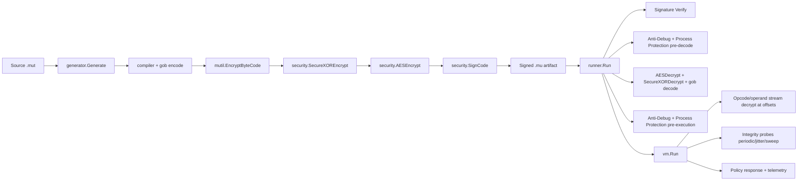
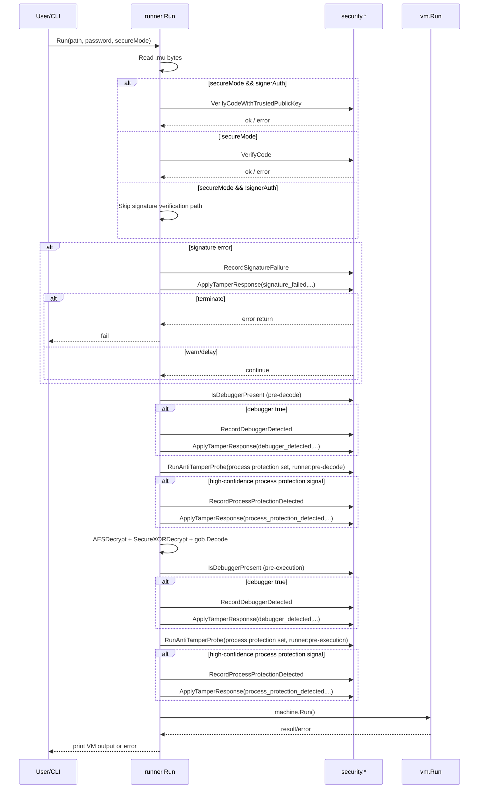
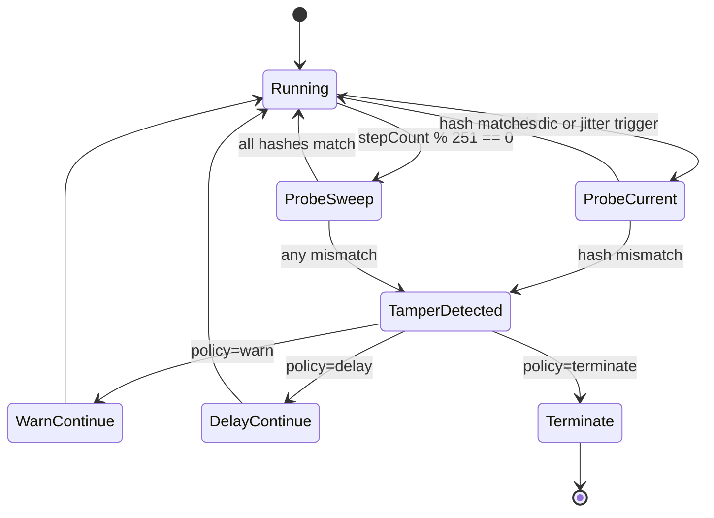
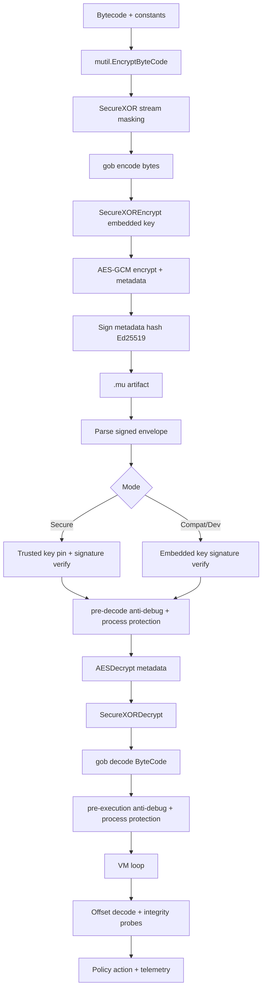

# Security Low-Level Design (LLD)

## 1. Document Purpose

This document defines the low-level security design for Mutant's bytecode
generation, signing, transport, loading, verification, runtime execution,
anti-debugging, integrity monitoring, and telemetry paths.

It is implementation-accurate to the current codebase and intended for:

- Security engineering and code reviews
- Incident response and operations enablement
- Regression prevention for future security changes
- Test strategy and CI policy enforcement

This LLD focuses on anti-tamper and anti-piracy controls under an offline-first
threat model.

Companion deep dives:

1. [BINARY_ARTIFACT_SECURITY_DEEP_DIVE](BINARY_ARTIFACT_SECURITY_DEEP_DIVE.md)
2. [REMOTE_PROCESS_SCAN_DEEP_DIVE](REMOTE_PROCESS_SCAN_DEEP_DIVE.md)

---

## 2. Security Objectives

### 2.1 Primary Objectives

1. Ensure tampered artifacts are detected before or during execution.
2. Ensure secure mode is fail-closed by default.
3. Protect payload confidentiality and integrity at rest.
4. Reduce effectiveness of dynamic analysis/debugging.
5. Detect runtime instruction tampering and respond per policy.
6. Provide observable security signals via telemetry and audit output.

### 2.2 Non-Objectives

1. Absolute malware-grade anti-debug resistance (not possible in pure userland).
2. Hardware-rooted trust chain (not implemented yet).
3. Remote attestation and centralized key management (not implemented yet).

---

## 3. Threat Model

### 3.1 In Scope Adversary Capabilities

1. Reads and modifies `.mu` artifacts on disk.
2. Attempts re-signing with attacker-generated keypairs.
3. Runs runtime under debugger/instrumentation.
4. Patches bytecode/in-memory instruction regions.
5. Replays older artifacts or malformed payloads.
6. Manipulates environment variables at launch.

### 3.2 Out of Scope (Current Release)

1. Kernel-level adversaries with arbitrary memory write.
2. Hypervisor-level introspection attacks.
3. Physical attacks against hardware secrets.

---

## 4. Security Modes and Policy Semantics

Mutant currently has three practical launch postures:

The definitive operator-facing table lives in
[EXECUTION_MODES.md](EXECUTION_MODES.md); this section states the design behind
it.

1. Secure mode (`--secure`, default):

- Runtime posture defaults to secure execution gates.
- Embedded self-verification always runs. Trusted signer pinning is an upgrade
  on top of it, enabled by `--signer-auth`.
- Default tamper response is `terminate`, printing the detector that fired, the
  reason, and the remedy.
- If `--trusted-key <path>` is not passed, the runtime bootstraps a local
  persistent keypair and uses the local public key as the trusted key for
  signer-auth verification.

2. Compatibility mode (`--compat`):

- Signature verification uses the embedded signer key (format validity only) --
  the same floor secure mode has, not a substitute for it.
- Default tamper response is `warn`.

3. Developer mode (`--dev`):

- Runtime behavior is forced to compatibility mode.
- If no runtime password is supplied for `.mu`, default deterministic local
  password fallback is used (`mutil.GetPwd()`).
- Intended for local testing convenience, not production hardening.

### 4.1 Mode Resolution Rules

A command line names at most one mode. `--secure --compat`, `--secure --dev` and
`--signer-auth --no-signer-auth` are rejected with a non-zero exit naming both
flags (`validateModeFlags`, `main.go`), before any other work.

- `--compat` or `--dev` -> mode becomes compatibility.
- `--dev --compat` is accepted: dev mode implies compatibility mode, so naming
  both is redundant rather than contradictory. Repeating a flag is harmless.

This used to be "last matching mode flag wins" due to linear arg scanning, with
`--dev` winning over `--secure` regardless of order. `mutant prog.mu --dev
--secure` therefore ran unsecured, having been asked in the same breath to run
secured, and said nothing about it.

### 4.2 Tamper Response Policy

Policy source: the execution mode, from the command line. Nothing else.
`ResolveTamperResponse(secureMode)` in `security/response_policy.go` is a pure
function of it.

Possible values:

- `warn`: log and continue
- `delay`: sleep then continue
- `terminate`: return error/fail

Resolution:

- dev mode (`--dev`): `warn`
- compatibility mode (`--compat`): `warn`
- secure mode (the default): `terminate`

`delay` is implemented in `ApplyTamperResponse` and sleeps
`DefaultTamperDelayMs` (a `250` ms constant, clamped to `[0..5000]` by
`MinTamperDelayMs`/`MaxTamperDelayMs`), but no mode selects it. It survives as
the seam a future response policy would use.

### 4.3 Protection Profiles

**Fixed at `standard`.** `ResolveProtectionProfile()` in `security/profile.go`
returns the constant `defaultProtectionProfile`; there is no selector, and no
precedence chain to reason about. Mutant takes no configuration from environment
variables, and posture is not a per-run decision. See
[CONFIGURATION_POLICY.md](CONFIGURATION_POLICY.md).

The three profile values remain as an on-disk encoding:

1. `minimal` (code `1`)
2. `standard` (code `2`) -- what `ResolveProtectionProfileCode()` always returns,
   and therefore what every V3 release trailer this build writes contains.
3. `paranoid` (code `3`)

`ProtectionProfileFromCode` maps a trailer byte back to a name, which is why all
three must stay: a trailer written by an older build can carry code `1` or `3`
and must still be readable.

`defaultTamperResponseForProfile` still switches on the profile, so its
`minimal` and `paranoid` arms exist in the source. They are unreachable at
runtime, because the value it switches on is a constant.

---

## 5. Component Architecture

### 5.1 Security-Critical Modules

1. `security/crypto.go`

- AES-GCM payload encryption/decryption
- metadata serialization/parsing

2. `security/kdf.go`

- Argon2id derivation and parameter validation
- deterministic HKDF utilities

3. `security/signing.go` + `security/signatures.go`

- Ed25519 signatures
- signed artifact envelope parse/verify
- trusted key pinning

4. `security/secure_random.go`

- ChaCha20 offset-aware stream masking
- secure compare/zeroing helpers

5. `security/response_policy.go`

- central tamper response decisions

6. `security/telemetry.go`

- counters, JSON snapshot/export, audit log

7. `security/antidebug_*.go`

- platform-specific debugger detection

8. `runner/runner.go`

- execution gate and staged enforcement

9. `vm/vm.go`

- runtime decode path + integrity probes + policy integration

10. `code/code.go`

- offset-aware operand reads

11. `object/secure_memory.go`

- secure wrappers and object offset conventions

---

## 6. Artifact Format and Cryptographic Construction

### 6.1 Signed Artifact Envelope (`.mu`)

Outer format:

`HEADER |-| ENCODED_DATA |-| SIGNATURE_HEX |-| PUBLIC_KEY_HEX |-| FOOTER`

Constants:

- `HEADER = MUT`
- `FOOTER = ANT`
- `OUTER_SEPERATOR = |-|`

Notes:

- Parser validates minimum parts and header/footer sentinels.
- Signature/public key are hex encoded.
- `ENCODED_DATA` is the serialized encryption metadata string.

### 6.1.1 Standalone Release Trailer

Release binaries produced by the generator append a standalone trailer after the
embedded runtime payload.

Current format version: V3

`MUTANTBC | version | payload_len | payload_sha256 | canary | profile_code | provenance_sha256`

Field details:

1. `version`

- V1 and V2 are accepted for legacy compatibility.
- V3 is the current emission format.

2. `payload_len`

- Big-endian `uint64` payload length.

3. `payload_sha256`

- SHA-256 over the embedded bytecode payload.

4. `canary`

- Short SHA-256 derived guard used to detect trailer corruption.

5. `profile_code`

- Encoded protection profile selected at build time.
- `1 = minimal`, `2 = standard`, `3 = paranoid`.

6. `provenance_sha256`

- SHA-256 over `payload || payload_sha256 || profile_code`.
- Used to detect tampering and mismatched release provenance.

Compatibility rules:

- Runner validates V3 first, then V2, then V1.
- V1 and V2 remain supported for older artifacts.
- V3 is required for new release builds.

### 6.2 Encrypted Metadata Payload

`ENCODED_DATA` format in password mode:

`ciphertext_b64 | salt_hex | <empty-sourcehash> | true | iter | memory | threads`

Deterministic mode variant stores `sourceHash` and `false`.

Constants:

- inner separator: `SEPERATOR = |`
- AEAD associated data: `ENCSIG = MUTANT`

### 6.3 Encryption Layers

Compilation encryption layering (current implementation):

1. VM bytecode and constants are stream-masked (`mutil.EncryptByteCode`,
   `SecureXOR`).
2. Full gob byte slice is XOR-wrapped with embedded random key
   (`SecureXOREncrypt`).
3. Result is AES-GCM encrypted using Argon2id-derived key (`AESEncrypt`).
4. Encrypted metadata is signed with Ed25519 (`SignCode`).

Rationale:

- AES-GCM gives confidentiality + integrity for payload.
- Signature protects authenticity and allows trusted signer pinning in secure
  mode.
- Additional stream/XOR layers increase analysis friction.

The standalone release trailer adds a separate provenance check path so the
runtime can validate the generated build profile and trailer integrity before
payload decode.

---

## 7. Key Derivation and Password Handling

### 7.1 Password KDF (Argon2id)

Derivation path:

- `DeriveKeyFromPassword(password, salt)`
- defaults:
  - time: 1
  - memory: 64 MB (`64*1024` KB)
  - threads: 4
  - key length: 32 bytes

Validation hard bounds:

- time: `[1..8]`
- memory: `[64MB..4GB]` in KB units
- threads: `[1..16]`

### 7.2 Password Quality Policy

Easy memorable passwords

### 7.3 Build-Time Profile Binding

Release generation binds the selected protection profile into the standalone
trailer via the `profile_code` field.

Security implication:

- The build mode becomes auditable in the emitted artifact.
- Trailer provenance mismatch is treated as tamper.
- Policy controls are fixed or flag-driven; nothing in the environment can
  override them.

### 7.4 Deterministic Local Password Fallback

`mutil.GetPwd()` uses HKDF-SHA512 over fixed context constants to produce a
deterministic local key string.

Used when:

- Single-arg `.mut`/`.mu` convenience paths.
- `--dev` mode running `.mu` without explicit `-pwd`.

Security implication:

- deterministic and recoverable from binary/source; convenience only.
- not a production secret.

---

## 8. Signing and Trust Model

### 8.1 Signature Primitive

- Algorithm: Ed25519
- Signing input: SHA-256 hash of `ENCODED_DATA`

### 8.2 Verification Paths

1. Compatibility verification (`VerifyCode`):

- Parses embedded public key and signature.
- Verifies signature correctness for envelope integrity.
- Does not enforce signer identity trust.

2. Secure verification (`VerifyCodeWithTrustedPublicKey`):

- Parses embedded public key/signature.
- Loads the trusted key from the file named by `--trusted-key <path>` when
  given. A missing, malformed or wrong-sized file is a hard error, never a
  silent fallback.
- Falls back to local key bootstrap resolution when the flag is absent.
- Constant-time compares embedded key with trusted key.
- On mismatch returns `ErrUntrustedSigner`.
- Verifies signature using trusted key.

### 8.3 Signing Key Injection

Build/signing key source:

- The local persistent keypair under `<home>/.mutant/keys`, loaded or
  bootstrapped by `EnsureLocalSigningKeyPair`
  (`generator/generate.go` -> `loadOrBootstrapSigningPrivateKey`). Creating it
  prints both paths to stderr.
- A caller of `generator.Generate` may pass a `privateKey` directly. Nothing on
  the CLI path does.

Signing key material never comes from the environment: it is the most sensitive
value in the system, and an environment variable is inherited by every child
process and invisible in the invocation. See
[CONFIGURATION_POLICY.md](CONFIGURATION_POLICY.md).

Operational risk:

- unmanaged local bootstrap keys can diverge from official release trust anchors
  if not governed by deployment policy. Verifying with `--trusted-key` pinned to
  the approved signer is what closes this.

---

## 9. Runtime Security Gate (`runner.Run`)

### 9.1 Telemetry Export Hook

None. `ExportSecurityTelemetry(path)` exists and writes the counter snapshot as
JSON, but the runner does not call it and no flag selects a path. Counters are
readable in-process through `SecurityTelemetrySnapshot()` and
`SecurityTelemetryJSON()`.

### 9.2 Standalone Trailer Validation

Before signature verification and decode, runner performs standalone trailer
validation when the binary appears to carry an appended payload.

Validation order:

1. V3 trailer
2. V2 trailer
3. V1 trailer

Checks performed:

1. trailer marker and version
2. payload length bounds
3. payload SHA-256
4. canary (V2+)
5. profile code validity and provenance hash (V3)

Failure handling:

- checksum mismatch -> reject payload
- canary mismatch -> reject payload
- provenance mismatch -> reject payload
- unsupported trailer version -> reject payload

### 9.3 Process-Protection Probe Enforcement

At both `pre-decode` and `pre-execution` stages, runner evaluates process
protection probes (`process_injection`, `trampoline`, `iat_got`,
`module_integrity`, `memory_page_anomaly`). `antiTamperProbeEnabled` is a
compile-time `true`, so they always run.

Rollout gate:

- `isProcessProtectionEnabled()` (`runner/runner.go`) controls whether the runner
  executes process-protection enforcement. It returns `true`.
- Not configurable. The runner reaches it through the `processProtectionOn`
  package variable, which tests replace to exercise the skip path.

Enforcement threshold:

- Any signal with `detected=true` and `confidence >= 80` is treated as a process
  protection event.

Response path:

- Telemetry event: `process_protection_detected`
- Policy dispatch: `ApplyTamperResponse(process_protection_detected, ...)`
- Default result: terminate in secure mode, warn in compatibility/dev mode.

### 9.4 Remote Process Scan Enforcement

Runner executes `RunRemoteProcessScan` at both `pre-decode` and `pre-execution`
stages.

Gates and modes -- all from `remoteScanConfigState`
(`security/processscan_config.go`), which ships disabled and is writable only by
`SetRemoteScanConfigForTesting`:

1. `Enabled` gates scan execution. It is `false`, so a shipped binary never
   scans.
2. `Mode` (`off|observe|enforce`, default `observe`) controls decision
   behaviour.
3. Scanner errors are telemetry-visible and non-blocking.

Current enforcement behavior:

1. `observe`: records telemetry only, never blocks execution.
2. `enforce`: blocks only when a verdict reaches the configured critical score.
3. High-risk but non-critical verdicts remain advisory.

Current implementation status:

1. Configuration, correlator, telemetry, and runner policy integration are
   implemented.
2. `ScanRemoteProcessesWindows` currently returns no verdicts (safe no-op), so
   remote verdict generation is scaffolding-ready but not yet signal-rich.
3. There is no way to switch it on outside a test. When one is added it will be
   a flag, not an environment variable. See
   [CONFIGURATION_POLICY.md](CONFIGURATION_POLICY.md).

---

## 10. VM Runtime Protection Internals

### 10.1 Offset-Aware Instruction Decode

VM fetch path decrypts opcode/operands at exact stream offsets:

- opcode: `SecureXOROneAt(ins[ip], seed=inslen, password, offset=ip)`
- `uint16` operands: `ReadUint16(..., offset=ip+1)`
- `uint8` operands: `ReadUint8(..., offset=ip+1)`

Security effect:

- avoids fixed-position-independent keystream reuse.
- ties decrypt stream byte to logical position.

### 10.2 Runtime Integrity Baselines

- Each compiled function instruction slice gets SHA-256 baseline at
  registration.
- Main function baseline seeded at VM init.
- Additional function baselines registered when frames are pushed.

### 10.3 Probe Scheduler

`runIntegrityProbes()` triggers checks by schedule:

1. periodic: every `integrityEvery` steps (default 64)
2. jittered: when `stepCount % 97 == integrityJitter % 97`
3. sweep: every 251 steps checks all active frames

### 10.4 Integrity Response

If current instruction hash differs from expected baseline:

1. `RecordIntegrityFailure(stage)`
2. `ApplyTamperResponse(integrity_failed, stage, vm.secureMode, err)`

Important implementation detail:

- The VM passes its own `secureMode`, which carries the launch mode, so an
  integrity failure follows the same rule as every other tamper event:
  `terminate` under the default posture, `warn` under `--compat` and `--dev`.
- This section previously claimed the VM forced `secureMode=true` here, making
  integrity the one check no mode could downgrade. It does not, and has not
  since `NewWithPasswordMode` began threading the launch mode into the VM.
  Whether it *should* be the exception is an open question -- the difference
  between "the host looks suspicious", which is a guess about the environment,
  and "this bytecode is not what was signed", which is not. It is recorded here
  rather than decided.

A termination prints the detector, the reason and the remedy before the run
stops -- see `ExplainTamperTermination` in
[security/response_policy.go](../security/response_policy.go) and
[EXECUTION_MODES.md](EXECUTION_MODES.md). The VM's security opcodes return their
error directly rather than going through the response policy, so they call the
explainer themselves.

### 10.5 Builtin Capability Configuration

Under design. No interface is specified.

---

## 11. In-Memory Object Protection

### 11.1 VM Stack/Object Paths

- `push()` attempts to encrypt objects before storing.
- `pop()` attempts to decrypt encrypted objects before use.
- arrays/hashes decrypt elements during construction.
- builtin call arguments decrypted before invocation.

### 11.2 Secure Wrappers (`object/secure_memory.go`)

Available primitives:

1. `SecureGlobal`

- encrypted value storage, typed set/get, secure clear.

2. `SecureStack`

- optional auto-encrypt idle entries after timeout.

3. `SecureConstantPool`

- encrypted constants with cache.

Current wiring note:

- VM runtime protection path primarily uses `mutil.EncryptObject` and
  `mutil.DecryptObject` in stack/global/constant handling.
- `object/secure_memory.go` provides additional wrappers and utilities that can
  be used by integrations, but they are not the primary VM storage path today.

Current policy gate:

- None. `resolveVMGlobalMemoryMode()` (`vm/vm.go`) returns `runtime`
  unconditionally, the performance-safe path.
- `wrapper` exists as a named constant and an unreached branch. It is the seam a
  future hardening mode would use; there is no way to select it.

Current helper-scope decision:

- no additional secure-memory helper types are required for this release beyond
  `SecureGlobal`, `SecureStack`, and `SecureConstantPool`
- revisit helper expansion only if threat-model requirements exceed current
  runtime encryption + optional wrapper mode coverage

### 11.3 Stream Offset Convention for Object Types

`objectStreamOffset`:

- integer -> 64
- string -> 128
- boolean -> 192
- default -> 256

Purpose:

- deterministic per-type stream segmentation and reduced overlap.

Limitations:

- plaintext exists transiently during runtime operations and conversions.
- Go string immutability limits guaranteed in-place wipe.

---

## 12. Anti-Debug Design

### 12.1 Entry Point

`IsDebuggerPresent()` dispatches by OS:

- windows -> `isDebuggerPresentWindows`
- linux -> `isDebuggerPresentLinux`
- darwin -> `isDebuggerPresentDarwin`

### 12.2 Windows Signals

High-confidence (single hit triggers):

1. `IsDebuggerPresent`
2. `CheckRemoteDebuggerPresent`
3. `NtQueryInformationProcess(ProcessDebugPort)`
4. `NtQueryInformationProcess(ProcessDebugObjectHandle)`

Low-confidence weak hits (threshold-based):

1. `OutputDebugString` timing anomaly
2. common debugger DLL presence

Decision rule:

- `shouldTriggerDebuggerByWeight(highConfidence, weakHits, weakThreshold=2)`

### 12.3 Linux Signals

1. `/proc/self/status` `TracerPid != 0`
2. parent commandline pattern matching for debugger/re tools
3. debugger-related env markers (`GDB_*`, `LLDB_*`, `VALGRIND_*`, `LD_PRELOAD`,
   etc.)

### 12.4 Darwin Signals

1. `sysctl` P_TRACED flag
2. parent process pattern match
3. debugging env markers (`LLDB_*`, `DYLD_INSERT_LIBRARIES`, etc.)

### 12.5 Enforcement Staging

Runner checks anti-debug at:

1. `pre-decode`
2. `pre-execution`

On detection:

- telemetry increment
- policy application (`warn`/`delay`/`terminate`)

---

## 13. Telemetry and Audit

### 13.1 Counters

Atomic counters:

1. `debugger_detected`
2. `integrity_failed`
3. `signature_failed`
4. `sandbox_detected`
5. `process_protection_detected`
6. `anti_tamper_probe_invoked`
7. `anti_tamper_probe_error`
8. `remote_process_scan_invoked`
9. `remote_process_scan_error`
10. `remote_process_suspicious`
11. `remote_process_critical`
12. `command_attempt`
13. `command_blocked`
14. `command_succeeded`
15. `command_failed`

### 13.2 APIs

1. `SecurityTelemetrySnapshot()` -> map
2. `SecurityTelemetryJSON()` -> serialized JSON
3. `ExportSecurityTelemetry(path)` -> file write mode `0600`
4. `ResetSecurityTelemetry()` -> test/ops reset

### 13.3 Audit Stream

Not implemented. `auditEvent(event, stage)` is called by every `Record*` counter
function but its body discards both arguments. The stderr line format it once
emitted was `[security-audit] ts=<unix> event=<...> stage=<...>`.

---

## 14. Error and Failure Semantics

### 14.1 Canonical Security Errors

1. `ErrWrongSignature`
2. `ErrPasswordRequired`
3. `ErrInvalidMetadata`
4. `ErrDebuggerDetected`
5. `ErrSandboxDetected`
6. `ErrProcessProtectionDetected`
7. `ErrUntrustedSigner`

### 14.2 Policy-Dependent Behavior

Same event can either:

1. terminate with original error (`terminate`)
2. continue with warning (`warn`)
3. continue after delay (`delay`)

### 14.3 Design Tradeoff

- Secure defaults maximize resistance but may impact debuggability.
- Compatibility/dev improves operator ergonomics but weakens security
  guarantees.

---

## 15. Detailed Dataflow

---

## 16. Testing and Verification Strategy

### 16.1 Unit/Integration Coverage Highlights

1. `security/security_test.go`

- trusted key pinning success/failure
- argon2 bounds validation
- stream XOR offset correctness
- telemetry counters/json/export
- policy defaults and response behavior
- compatibility mixed artifact behavior
- anti-debug weighting logic
- anti-tamper probe routing and process-protection signal set

2. `runner/runner_test.go`

- secure mode malformed/tampered payload rejection
- compatibility mode continue-on-signature-failure behavior
- secure-mode termination on high-confidence process-protection signal
- advisory behavior for sub-threshold process-protection signal

3. `vm/vm_security_policy_test.go`

- integrity tamper behavior under `warn`, `delay`, `terminate`

### 16.2 CI Security Profile

Workflow `.github/workflows/security-profile.yml`:

- strict defaults (`terminate`, delay=0, audit=1)
- targeted security packages + VM policy test
- optional telemetry artifact upload

---

## 17. Security Invariants (Must Hold)

1. When `--signer-auth` is enabled in secure mode, trusted signer verification
   must be enforced (the key given by `--trusted-key`, or the local bootstrap
   trusted key).
2. In signer-auth path, signature mismatch/untrusted signer must fail unless
   policy is explicitly downgraded by launch mode (`--compat` / `--dev`).
3. Integrity mismatch must always record telemetry before policy action.
4. Metadata parser must reject malformed Argon2 parameters.
5. Opcode/operand decode must stay offset-aware.
6. Telemetry export path must not fail open to panic.

---

## 18. Residual Risks and Limitations

1. Compatibility/dev mode can be misused in production if not controlled.
2. Env-driven policy downgrades (`warn`/`delay`) can reduce enforcement.
3. Userland anti-debug remains bypassable by binary patching.
4. No hardware trust anchor or attestation.
5. Deterministic fallback password is convenience-only and not secret.
6. Full Windows runtime integration tests on real CI runners remain pending.
7. Full compile-sign-run-tamper rerun lifecycle tests remain incomplete.

---

## 19. Operational Guidance

Mutant takes no configuration from environment variables, so an operational
baseline is a command line and nothing else. See
[CONFIGURATION_POLICY.md](CONFIGURATION_POLICY.md).

### 19.1 Recommended Production Baseline

1. Launch with `--secure --signer-auth`.
2. Pass `--trusted-key <path>` naming the release signer's public key file.
   Without it, verification falls back to a locally bootstrapped keypair, which
   trusts whatever signed the artifact on this host.
3. Do not pass `--compat` or `--dev`. Secure mode already resolves the tamper
   response to `terminate`, and those flags are the only thing that changes it.
4. Record the full command line with the artifact. It is the complete
   description of how the run was configured.

### 19.2 Developer Baseline

1. Use `--dev` for local test convenience only.
2. Avoid using `--dev` artifacts/behavior as production acceptance signal.
3. Because every switch is a flag, the difference between a dev run and a
   production run is visible in the two command lines. There is no ambient
   state to drift.

---

## 20. Future Hardening Backlog (LLD-Level)

1. Add compile-sign-run-tamper-rerun end-to-end suites.
2. Add real Windows runner-based anti-debug integration tests.
3. Add signer key rotation and multi-key trust set support.
4. Add self-integrity hashing of selected runtime text/function regions.
5. Add policy lock mode to ignore mode-based downgrades in production builds.
6. Consider hardware-backed key protection for signing workflows.
7. Expand telemetry schema with per-event reason codes and monotonic sequence
   IDs.

---

## 21. Appendix A: Key Functions by Responsibility

### Build-Time

1. `generator.Generate`
2. `generator.encryptCode`
3. `security.AESEncrypt`
4. `security.SignCode`

### Run-Time Gate

1. `runner.Run`
2. `runner.enforceAntiDebug`
3. `runner.decryptCode`

### Runtime VM

1. `vm.Run`
2. `vm.runIntegrityProbes`
3. `vm.verifyFrameIntegrity`

### Security Core

1. `security.VerifyCode`
2. `security.VerifyCodeWithTrustedPublicKey`
3. `security.ApplyTamperResponse`
4. `security.Record*` telemetry APIs
5. `security.IsDebuggerPresent`

---

## 22. Appendix B: Mode/Policy Decision Table

| Execution Posture          | Signature Verification Path      | Default Policy | Wrong Signature / Untrusted Key | Debugger Hit | Integrity Mismatch |
| -------------------------- | -------------------------------- | -------------- | ------------------------------- | ------------ | ------------------ |
| Secure (`--secure`)        | Self-verify; trusted key pinning with `--signer-auth` | terminate | stop | stop | stop |
| Compatibility (`--compat`) | Self-verify (embedded key)       | warn           | continue/log                    | continue/log | continue/log       |
| Developer (`--dev`)        | Self-verify (embedded key)       | warn           | continue/log                    | continue/log | continue/log       |

The posture column is the whole input. There is no downgrade path that is not
one of these three flags -- see §4.2 and
[CONFIGURATION_POLICY.md](CONFIGURATION_POLICY.md), and naming two of them is an
error rather than a resolution (§4.1).

The integrity-mismatch column used to read "stop (VM forces secure policy)" for
the two weaker postures. It does not: `vm.secureMode` carries the launch mode
into both integrity checks (`vm/vm.go`), so under `--compat` and `--dev` a
mismatch warns and the run continues, like every other tamper event. Whether the
integrity check should be the one exception to the mode rule is an open
question; the table states what the code does.

---

## 23. Appendix C: Design Review Checklist

1. Any new security check records telemetry before response.
2. Any new response path uses `ApplyTamperResponse` consistently.
3. Any new opcode/operand decode remains offset-aware.
4. Any metadata schema changes preserve strict parse/validation behavior.
5. Any new compatibility shortcut is explicitly blocked in secure mode.
6. Any CI changes preserve targeted security profile execution.

---

End of document.
