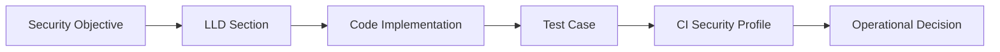
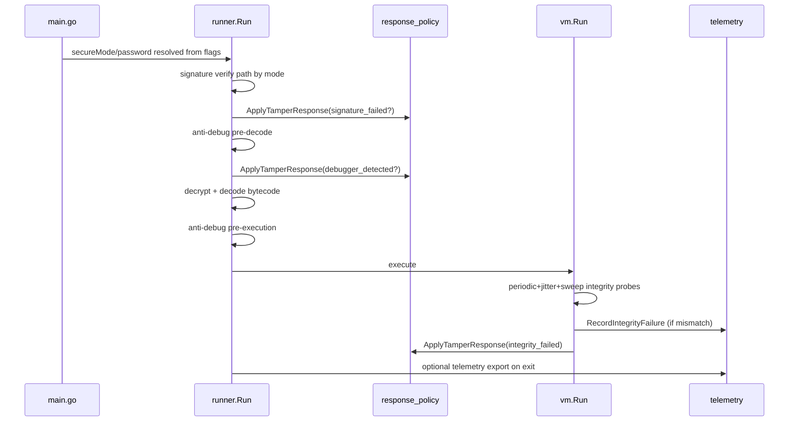

# Security LLD Traceability Matrix

## 1. Purpose

This document provides end-to-end traceability from security design intent to
concrete implementation and validation.

It maps:

1. Security requirements and controls
2. Implementation anchors (functions/files)
3. Runtime configuration surfaces (flags/env)
4. Test coverage and CI enforcement
5. Residual gaps and next validation actions

---

## 2. Traceability Model

Evidence levels used in this matrix:

- `I` = implemented
- `T` = tested
- `C` = CI wired
- `P` = partial / pending depth

---

## 3. Security Control Matrix

| ID      | Control Requirement                                                                | LLD Area                      | Implementation Anchors                                                                                                                                                                                                                                                                                                          | Config Surface                                            | Tests / CI Evidence                                                                                                                                                                                                         | Status |
| ------- | ---------------------------------------------------------------------------------- | ----------------------------- | ------------------------------------------------------------------------------------------------------------------------------------------------------------------------------------------------------------------------------------------------------------------------------------------------------------------------------- | --------------------------------------------------------- | --------------------------------------------------------------------------------------------------------------------------------------------------------------------------------------------------------------------------- | ------ |
| SEC-001 | Signed artifact envelope must be parsed and verified before execution              | Artifact format + trust model | [security/signatures.go](../security/signatures.go#L33), [security/signatures.go](../security/signatures.go#L54), [security/signatures.go](../security/signatures.go#L98), [runner/runner.go](../runner/runner.go#L27)                                                                                                                      | Mode-driven path: `--secure` / `--compat` / `--dev`       | [security/security_test.go](../security/security_test.go#L101), [runner/runner_test.go](../runner/runner_test.go#L13)                                                                                                            | I/T/C  |
| SEC-002 | Secure mode must pin signer identity to trusted key                                | Secure mode semantics         | [runner/runner.go](../runner/runner.go#L27), [security/signatures.go](../security/signatures.go#L54), [security/const.go](../security/const.go#L12)                                                                                                                                                                                      | `--trusted-key <path>`                                    | [security/security_test.go](../security/security_test.go#L122), [runner/runner_test.go](../runner/runner_test.go#L45)                                                                                                             | I/T/C  |
| SEC-003 | Signature failure handling must be policy-driven                                   | Tamper response policy        | [runner/runner.go](../runner/runner.go#L35), [runner/runner.go](../runner/runner.go#L43), [security/response_policy.go](../security/response_policy.go#L34)                                                                                                                                                                              | `--secure` / `--compat` / `--dev`                         | [security/security_test.go](../security/security_test.go#L295), [runner/runner_test.go](../runner/runner_test.go#L30)                                                                                                             | I/T/C  |
| SEC-004 | Payload confidentiality and integrity at rest must use AEAD                        | Crypto layer                  | [security/crypto.go](../security/crypto.go#L29), [security/crypto.go](../security/crypto.go#L132), [security/const.go](../security/const.go#L9)                                                                                                                                                                                          | Password input and metadata                               | indirect via runner decode path tests [runner/runner_test.go](../runner/runner_test.go#L76)                                                                                                                                    | I/T/P  |
| SEC-005 | Password-based key derivation must use bounded Argon2id params                     | KDF hardening                 | [security/kdf.go](../security/kdf.go#L42), [security/kdf.go](../security/kdf.go#L97), [security/crypto.go](../security/crypto.go#L196)                                                                                                                                                                                                   | password mode + metadata fields                           | [security/security_test.go](../security/security_test.go#L147)                                                                                                                                                                 | I/T    |
| SEC-006 | Password quality policy required when explicit password mode is used               | Password policy               | [security/kdf.go](../security/kdf.go#L73), [generator/generate.go](../generator/generate.go#L26)                                                                                                                                                                                                                                      | prompt / `--password-file` / `--password-stdin` (`-password` deprecated) | covered by generator path behavior and policy validation unit scope                                                                                                                                                         | I/P    |
| SEC-007 | Runtime instruction decode must be offset-aware to reduce keystream reuse          | VM decode hardening           | [vm/vm.go](../vm/vm.go#L90), [code/code.go](../code/code.go#L177), [code/code.go](../code/code.go#L190), [security/secure_random.go](../security/secure_random.go#L39)                                                                                                                                                                      | runtime password/seed context                             | [security/security_test.go](../security/security_test.go#L179), [security/security_test.go](../security/security_test.go#L197)                                                                                                    | I/T/C  |
| SEC-008 | Runtime integrity checks must detect instruction tampering                         | VM integrity probes           | [vm/vm.go](../vm/vm.go#L333), [vm/vm.go](../vm/vm.go#L662), [vm/vm.go](../vm/vm.go#L681)                                                                                                                                                                                                                                                 | policy + secure default behavior                          | [vm/vm_security_policy_test.go](../vm/vm_security_policy_test.go#L11)                                                                                                                                                          | I/T/C  |
| SEC-009 | Integrity failures must trigger telemetry and policy action                        | Telemetry + policy coupling   | [vm/vm.go](../vm/vm.go#L697), [security/telemetry.go](../security/telemetry.go#L25), [security/response_policy.go](../security/response_policy.go#L34)                                                                                                                                                                                   | None; VM forces secure policy                             | [vm/vm_security_policy_test.go](../vm/vm_security_policy_test.go#L21), [vm/vm_security_policy_test.go](../vm/vm_security_policy_test.go#L41), [vm/vm_security_policy_test.go](../vm/vm_security_policy_test.go#L59)                  | I/T/C  |
| SEC-010 | Anti-debug checks must be staged before decode and before execution                | Runtime gate enforcement      | [runner/runner.go](../runner/runner.go#L49), [runner/runner.go](../runner/runner.go#L58), [runner/runner.go](../runner/runner.go#L67)                                                                                                                                                                                                    | mode + tamper response env                                | policy behavior tests [security/security_test.go](../security/security_test.go#L295)                                                                                                                                           | I/T/P  |
| SEC-011 | Debugger detection must be platform-specific with weighted signal logic on Windows | Anti-debug platform design    | [security/antidebug.go](../security/antidebug.go#L29), [security/antidebug_windows.go](../security/antidebug_windows.go#L32), [security/antidebug_weighting.go](../security/antidebug_weighting.go#L3), [security/antidebug_linux.go](../security/antidebug_linux.go#L15), [security/antidebug_darwin.go](../security/antidebug_darwin.go#L17) | runtime OS selection                                      | [security/security_test.go](../security/security_test.go#L349)                                                                                                                                                                 | I/T/P  |
| SEC-012 | Security telemetry must support atomic counters and secure export                  | Telemetry subsystem           | [security/telemetry.go](../security/telemetry.go#L20), [security/telemetry.go](../security/telemetry.go#L35), [security/telemetry.go](../security/telemetry.go#L48)                                                                                                                                                                      | None; in-process API only                                 | [security/security_test.go](../security/security_test.go#L205), [security/security_test.go](../security/security_test.go#L230) | I/T/C  |
| SEC-013 | CLI must clearly resolve secure/compat/dev mode and developer fallback semantics   | CLI posture controls          | [main.go](../main.go#L165), [main.go](../main.go#L180), [main.go](../main.go#L118), [main.go](../main.go#L129)                                                                                                                                                                                                                              | `--secure`, `--compat`, `--dev`, `-pwd`                   | operationally validated in local runtime use; no dedicated CLI parsing tests yet                                                                                                                                            | I/P    |
| SEC-014 | Generator must use a stable per-host signing identity                              | Signing workflow              | [generator/generate.go](../generator/generate.go#L36), [generator/generate.go](../generator/generate.go#L80), [security/key_bootstrap.go](../security/key_bootstrap.go#L37)                                                                                                                                                                              | None; local keystore only                                 | indirectly validated by signature verification tests                                                                                                                                                                        | I/P    |
| SEC-015 | CI must run the security suites on every supported OS                              | CI control plane              | [.github/workflows/ci.yml](../.github/workflows/ci.yml#L15), [.github/workflows/ci.yml](../.github/workflows/ci.yml#L36)                                                                                                                                                       | CI env defaults and artifact upload                       | workflow itself + package tests invoked by CI                                                                                                                                                                               | I/C    |
| SEC-016 | Protection profile must define default tamper behavior                             | Runtime policy profile        | [security/profile.go](../security/profile.go), [security/response_policy.go](../security/response_policy.go)                                                                                                                                                                                                                          | None; fixed at `standard`                                 | [security/security_test.go](../security/security_test.go)                                                                                                                                                                      | I/T    |
| SEC-017 | Builtin capability configuration (under design)                                    | Builtin capability gates      | [builtin/builtin.go](../builtin/builtin.go), [builtin/command_exec.go](../builtin/command_exec.go), [builtin/fs.go](../builtin/fs.go), [builtin/net.go](../builtin/net.go), [builtin/http.go](../builtin/http.go)                                                                                                                              | Under design                                              | [builtin/command_exec_test.go](../builtin/command_exec_test.go)                                                                                                                                                                | I/T    |
| SEC-018 | Standalone release artifacts must carry profile attestation and provenance         | Release trailer attestation   | [generator/writebinary.go](../generator/writebinary.go), [runner/runner.go](../runner/runner.go), [security/profile.go](../security/profile.go), [security/const.go](../security/const.go)                                                                                                                                                  | build profile + release generation path                   | [runner/runner_test.go](../runner/runner_test.go)                                                                                                                                                                              | I/T    |

---

## 4. Runtime Decision Trace

---

## 5. Flag Traceability

Every switch is a command-line flag. Mutant reads no environment variable for
configuration, so this section is the complete control surface. See
[CONFIGURATION_POLICY.md](CONFIGURATION_POLICY.md).

0. Mode-flag validation

- `validateModeFlags` rejects a command line naming two contradictory postures
  before any other work, so the selectors below are read from a command line
  that names at most one mode
- anchor: [main.go](../main.go)

1. `--secure` / `-secure`

- default secure posture selector and explicit assertion of it
- anchor: [main.go](../main.go)

2. `--compat` / `-compat`

- compatibility posture selector
- anchor: [main.go](../main.go#L187)

3. `--dev` / `-dev`

- compatibility posture + default local password fallback for `.mu` when
  password omitted
- anchors: [main.go](../main.go#L202), [main.go](../main.go#L329)

4. Password sources: prompt (default), `--password-file`, `--password-stdin`,
   `--password-insecure`, and the deprecated `-password` / `-pwd` /
   `--password=` / `--pwd=`

- collected into a `credential.Request` by `extractPasswordRequest`, then
  resolved by `credential.Resolver`, which rejects a command line naming more
  than one source
- the deprecated argv forms emit a warning naming the process-table exposure
- anchors: [main.go](../main.go), [credential/credential.go](../credential/credential.go)

5. `--signer-auth` / `--no-signer-auth`

- upgrade signature verification to a trusted public key, or decline to;
  self-verification is the floor in every mode either way
- anchors: [main.go](../main.go#L714), [runner/runner.go](../runner/runner.go#L93)

6. `--trusted-key <path>`

- file holding the hex-encoded ed25519 public key to verify against; falls back
  to the local keystore when absent
- anchors: [main.go](../main.go#L223),
  [security/key_bootstrap.go](../security/key_bootstrap.go#L85)

7. `--security-log-level <level>` / `--log-level <level>`

- security logging verbosity in dev mode
- anchor: [main.go](../main.go#L240)

8. `--timing`

- per-stage run timing on stderr
- anchor: [main.go](../main.go#L211)

### 5.2 Fixed behaviour (no control surface)

These were once environment variables and are now constants. Listed so a
reviewer does not go looking for the control that used to exist:

1. Protection profile -- `standard`
   ([security/profile.go](../security/profile.go)).
2. Tamper response -- derived from the mode flags above
   ([security/response_policy.go](../security/response_policy.go)).
3. Tamper delay -- `250` ms; no mode selects the `delay` response.
4. Anti-tamper probe gate -- always on
   ([security/antitamper_probe.go](../security/antitamper_probe.go)).
5. Process-protection gate -- always on
   ([runner/runner.go](../runner/runner.go)).
6. Remote process scan -- off; test-only setter
   ([security/processscan_config.go](../security/processscan_config.go)).
7. Audit stream and telemetry export -- no-op and uncalled respectively
   ([security/telemetry.go](../security/telemetry.go)).
8. Signing key -- local keystore only
   ([security/key_bootstrap.go](../security/key_bootstrap.go)).
9. Builtin capability configuration -- under design.

---

## 6. Test Coverage Map by Attack Scenario

| Attack Scenario                                   | Expected Security Behavior                                          | Primary Tests                                                                                                            |
| ------------------------------------------------- | ------------------------------------------------------------------- | ------------------------------------------------------------------------------------------------------------------------ |
| malformed `.mu` envelope in secure mode           | reject before decode                                                | [runner/runner_test.go](../runner/runner_test.go#L13)                                                                       |
| malformed envelope in compat mode                 | policy may continue; fail later during decode                       | [runner/runner_test.go](../runner/runner_test.go#L30)                                                                       |
| tampered signer identity                          | secure mode rejects untrusted signer                                | [runner/runner_test.go](../runner/runner_test.go#L45), [security/security_test.go](../security/security_test.go#L122)          |
| trusted signer valid but payload unusable         | signature path passes, decode fails correctly                       | [runner/runner_test.go](../runner/runner_test.go#L76)                                                                       |
| integrity tamper under `warn/delay/terminate`     | policy-specific continue/fail behavior with telemetry increment     | [vm/vm_security_policy_test.go](../vm/vm_security_policy_test.go#L11)                                                       |
| response policy default/override correctness      | secure default terminate, compat default warn, env override honored | [security/security_test.go](../security/security_test.go#L275), [security/security_test.go](../security/security_test.go#L295) |
| stream-mask roundtrip and offset byte correctness | decryptability and offset-specific correctness                      | [security/security_test.go](../security/security_test.go#L179), [security/security_test.go](../security/security_test.go#L197) |
| telemetry JSON/export correctness                 | counters and file export valid                                      | [security/security_test.go](../security/security_test.go#L205), [security/security_test.go](../security/security_test.go#L230) |
| windows weak/high-confidence weighting            | threshold behavior stable                                           | [security/security_test.go](../security/security_test.go#L349)                                                              |

---

## 7. Known Traceability Gaps

The following areas are represented in LLD but only partially evidenced at
integration depth:

1. Real Windows runner integration execution with genuine debugger signals (`P`
   depth remains).
2. Full compile -> sign -> run -> tamper -> rerun lifecycle integration suite.
3. Dedicated CLI flag parsing tests for secure/compat/dev precedence.
4. Explicit unit coverage for generator password complexity rejection path.
5. Signed-key rotation lifecycle tests (multi-key trust/rollover not yet
   implemented).

---

## 8. Recommended Validation Backlog

1. Add `main` CLI parsing tests covering mixed mode flag order and dev fallback
   behavior.
2. Add e2e fixture tests that produce real `.mu` artifacts and validate tamper
   outcomes in all policies.
3. Add a Windows CI job for runtime anti-debug policy verification on
   hosted/self-hosted runner.
4. Done: negative tests for a malformed, wrong-sized and missing
   `--trusted-key` file
   ([security/key_bootstrap_test.go](../security/key_bootstrap_test.go)).
5. Add deterministic artifact compatibility tests to guard accidental
   secure/compat behavior drift.

---

## 9. Quick Audit Checklist (Reviewer Use)

1. Secure mode with `--signer-auth` resolves a trusted key, and a
   `--trusted-key` file that is missing or malformed fails the run rather than
   falling back.
2. Any signature, debugger, or integrity event routes through policy layer.
3. Telemetry increments occur before policy returns error on terminate.
4. VM operand/opcode decode remains offset-aware.
5. CI still runs `go test ./...` on Windows, Linux and macOS, which includes
   the security suites and the configuration guard in `policy/`.
6. Dev mode remains explicit and does not silently alter secure mode defaults
   unless chosen.

---

## 10. Probe and Process-Protection Traceability

### 10.1 Control Additions

1. Master anti-tamper probe gate: `antiTamperProbeEnabled`, a compile-time
   `true`. Not configurable.
2. Runner process-protection gate: `isProcessProtectionEnabled()`, which returns
   `true`. Not configurable.
3. Runner enforcement threshold: any probe signal with `detected=true` and
   `confidence >= 80`. This is the only decision point left.

### 10.2 Implementation Anchors

1. Probe gate and engine: `security/antitamper_probe.go`
2. Probe routing: `security/antitamper_routing.go`
3. Probe implementations:
   - `security/antitamper_detectors.go`
   - `security/antitamper_windows.go`
4. Runner enforcement path: `runner/runner.go`
5. Builtin diagnostics probe use: `builtin/security_status.go`

### 10.3 Operational Notes

1. Runner enforcement probe scope is intentionally narrower than builtin
   diagnostic scope.
2. If the master probe gate is disabled, runner process-protection enforcement
   will not execute probe logic even when the process-protection gate is
   enabled. Only a test can reach that state.

---

## 11. 2026-07 Code Sync Addendum

This addendum captures code-accurate deltas that must be read together with the
matrix above.

### 11.1 Signer-Auth Runtime Semantics

Current implementation:

1. Secure mode selection and signer-auth are independent runtime switches.
2. Trusted signer verification path runs only when `--signer-auth` is present.
3. `--no-signer-auth` keeps secure-mode runtime gates but skips signature
   verification path in runner.

Anchors:

1. [main.go](../main.go#L578)
2. [runner/runner.go](../runner/runner.go#L44)
3. [runner/runner_test.go](../runner/runner_test.go#L189)

### 11.2 Remote Process Scan Control Surface

Current implementation:

1. Remote scan manager is gated by `remoteScanConfigState.Enabled`, which is
   `false` in every shipped binary and writable only by
   `SetRemoteScanConfigForTesting`.
2. Mode is `remoteScanConfigState.Mode` (`off|observe|enforce`, default
   `observe`).
3. Runner blocks only on enforce-mode critical verdicts.
4. Scan errors are non-blocking and telemetry-visible.

Anchors:

1. [security/processscan_config.go](../security/processscan_config.go#L9)
2. [security/processscan_manager.go](../security/processscan_manager.go#L7)
3. [runner/runner.go](../runner/runner.go#L161)
4. [runner/runner_test.go](../runner/runner_test.go#L404)

### 11.3 Remote Scan Runtime Depth

Current implementation status:

1. Types/config/correlator/manager/telemetry and runner integration are
   implemented.
2. Windows scanner implementation currently returns empty verdicts (`nil, nil`),
   so enforcement path is wired but detector depth is still scaffolding-first.

Anchors:

1. [security/processscan_windows.go](../security/processscan_windows.go#L5)
2. [security/processscan_manager_test.go](../security/processscan_manager_test.go#L36)

---

End of document.
