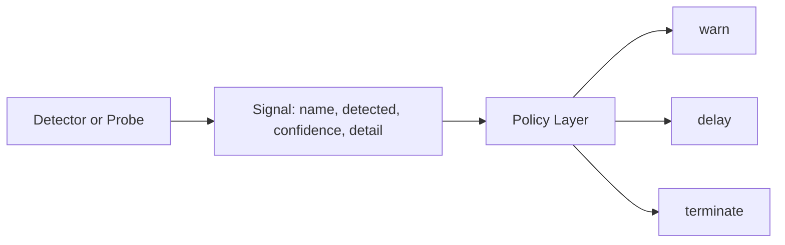
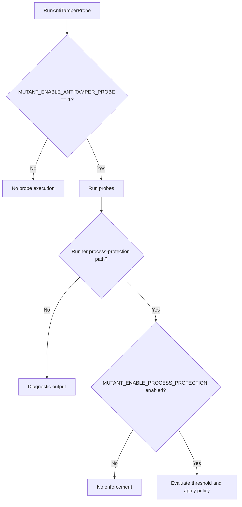
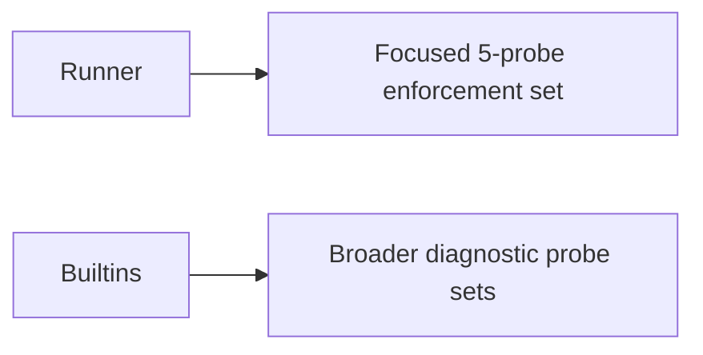
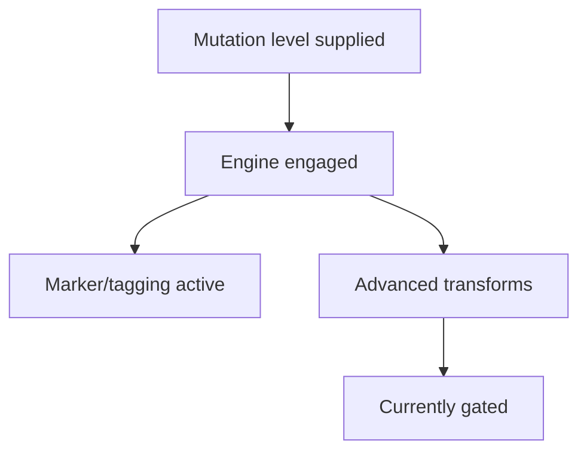
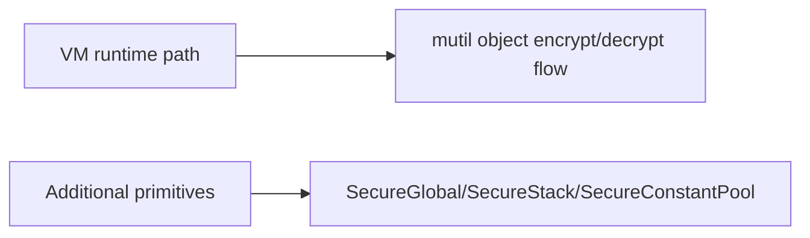

# Visual Comparison (Current Security Model)

## 1. Detection vs Enforcement

Old confusion:

1. Signal and action were treated as the same concept.

Current model:

1. Signal generation is separate from policy action.

## 2. Probe Gates

## 3. Process Protection Scope

## 4. Polymorphic Status Snapshot

## 5. Memory Hardening Snapshot

## 6. Source of Truth

1. [SECURITY_DIAGRAMS](SECURITY_DIAGRAMS.md)
2. [SECURITY_LLD](SECURITY_LLD.md)
3. [ANTITAMPER_PROBE_ENABLEMENT_LLD](ANTITAMPER_PROBE_ENABLEMENT_LLD.md)
4. [POLYMORPHIC_BYTECODE_LLD](POLYMORPHIC_BYTECODE_LLD.md)
